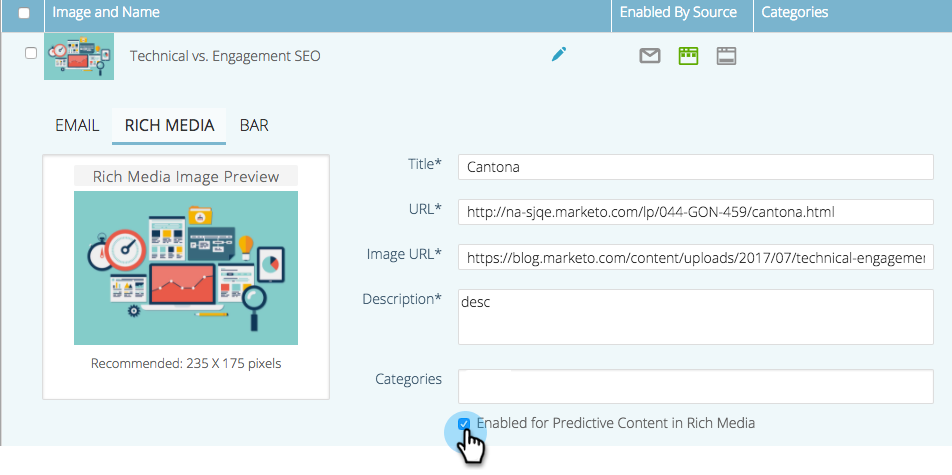

# Voorspelende inhoud voor web-rijke media inschakelen {#enable-predictive-content-for-web-rich-media}

Met voorspellende inhoud hebben uw webbezoekers de meest relevante inhoud, aangedreven door machinaal leren en voorspellende analyses. Met Web Rich Media, kunt u uw inhoud met tekstbeschrijvingen en beelden verbeteren en veelvoudige voorspellende inhoudaanbevelingen op uw website inbedden.

>[!NOTE]
>
>U wordt aangeraden meer dan vijf delen inhoud per categorie en per bron (e-mail, rich media, balk) in te schakelen voordat u de voorspellende inhoud gaat testen en gebruiken. Meer inhoud geeft u een beter voorspelbaar resultaat.

>[!PREREQUISITES]
>
>Voordat u voorspellende inhoud inschakelt, moet u:
>
>* **Voorspelende inhoud voorbereiden**
>
>   * [Voorspelende inhoud voor e-mails bewerken](/help/marketo/product-docs/predictive-content/working-with-predictive-content/edit-predictive-content-for-emails.md){target="_blank"} of
>   * [Predictieve inhoud voor rijke media bewerken](/help/marketo/product-docs/predictive-content/working-with-predictive-content/edit-predictive-content-for-rich-media.md){target="_blank"} of
>   * [Voorspelende inhoud voor de balk met aanbevelingen bewerken](/help/marketo/product-docs/predictive-content/working-with-predictive-content/edit-predictive-content-for-the-recommendation-bar.md){target="_blank"}
>
>* [Een titel voor preventieve inhoud goedkeuren](/help/marketo/product-docs/predictive-content/working-with-all-content/approve-a-title-for-predictive-content.md){target="_blank"}

Nadat u de titel, beschrijving en afbeelding van de inhoud hebt voorbereid voor veelzijdige media, kunt u afzonderlijke of meerdere inhoudsonderdelen inschakelen.

1. Als u een afzonderlijke titel wilt inschakelen, klikt u op een titel om de editor te openen. Klik op Rijke media en controleer vervolgens de knop **Ingeschakeld voor voorspellende inhoud in rijke media** en klik op **Opslaan**.

   

1. Voor meerdere inhoud, op de knop **Voorspelende inhoud** , schakelt u de vakjes naast de titel(s) in.

   

1. Klik op de knop **Inhoudshandelingen** vervolgkeuzelijst en selecteer **Enable for Web Rich Media**.

   |

## De JavaScript-code aanpassen en in uw website insluiten  {#customize-the-javascript-code-and-embed-it-into-your-website}

Verwijs naar de documentatie voor het Rich Media Aanbeveling malplaatje [op de Marketo Developers-site](https://experienceleague.adobe.com/nl/docs/marketo-developer/marketo/javascriptapi/rich-media-recommendation){target="_blank"}. Hierin wordt uitgelegd hoe u de sjabloon voor uw website kunt aanpassen.

Plak de JavaScript-code in uw website op de locatie waar u de sjabloon wilt weergeven.

**Sjabloonvoorbeelden**

* Template1: Drie horizontale inhoudsstukken met beelden, kopbal, en beschrijving
* Template2: Drie verticale inhoudsonderdelen met afbeeldingen, koptekst en beschrijving

Hier is een voorbeeld van Rich Media Recommendation Template1:

Hier is een voorbeeld van Rich Media Recommendation Template2:

