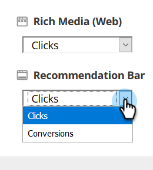

# Standaardinstellingen algoritme {#algorithm-goal-settings}

De Montages van het Doel van het Algoritme staat u toe om het einddoel van het kunstmatige van de Inhoudsintelligentie algoritme te plaatsen om zich aan uw bedrijfsdoelstellingen te richten.

1. Klik in Voorspelende inhoud op de naam van uw aanmelding en selecteer **[!UICONTROL Content Settings]** .

   

1. Selecteer onder Instellingen voor inhoud de optie **[!UICONTROL Algorithm]** .

   

1. Selecteer voor elke bron van voorspellende inhoud een doel voor het AI-algoritme om de prestaties van de inhoud te maximaliseren.

   

   | **[!UICONTROL Clicks]** | De inhoud weergeven die de persoon die de inhoud bekijkt het meest waarschijnlijk zal maken om erop te klikken |
   |---|---|
   | **[!UICONTROL Conversions]** | De inhoud weergeven die de persoon die de inhoud bekijkt het meest waarschijnlijk maakt om een formulier te verzenden |

1. Klik op **[!UICONTROL Save]** als u klaar bent.

   
