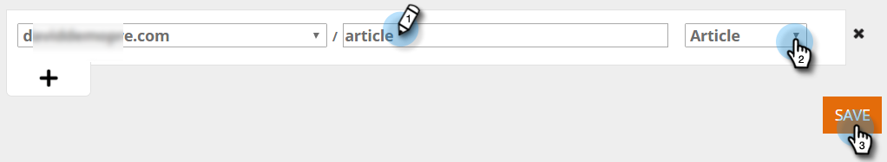

# Inhoudspatronen maken {#create-content-patterns}

Wanneer u inhoudspatronen instelt, wordt de inhoud automatisch gedetecteerd wanneer een webbezoeker op de HTML-webpagina klikt die relevant is voor het inhoudspatroon. Hiermee worden HTML-pagina&#39;s (blogberichten, persberichten, nieuwsartikelen) toegevoegd als inhoudsonderdelen op de pagina Alle inhoud. Wanneer automatisch detecteren is gebaseerd op inhoudspatronen, worden HTML-pagina&#39;s gedetecteerd en bijgehouden die verwant zijn aan het gedefinieerde URL-patroon wanneer een webbezoeker een koppeling naar de pagina weergeeft of klikt. Dit inhoudsonderdeel (de URL, de paginanaam en de metagegevens inclusief de URL en beschrijving van de afbeelding) wordt toegevoegd aan de pagina Alle inhoud om voorspellende inhoud voor te bereiden. Voor automatische detectie van andere inhoud, zoals PDF&#39;s en ingesloten video, moet u [detectie van inhoud inschakelen](/help/marketo/product-docs/predictive-content/getting-started/enable-content-discovery.md).

1. Ga naar **Inhoudsinstellingen**.

   

1. Klik **URL-patronen**.

   

1. Klik **+** om een rij te openen waar u uw informatie kunt ingaan.

   

1. Voeg de URL-extensie toe van het domein waar de webpagina bestaat. Selecteer de categorie (bijvoorbeeld Blog, Artikel, Gegevensblad, Persbericht).

   

   >[!NOTE]
   >
   >De punten in de drop-down lijst op het recht wijzen op de categorieën u opstelling wanneer u [categorieën ](/help/marketo/product-docs/predictive-content/getting-started/set-up-categories.md) creeerde.

1. Klik **+** om een ander pad toe te voegen.

   

1. Voeg de extensie en de categorie voor het extra pad toe en klik op **Opslaan**.

   

## Regels voor inhoudspatroon {#content-pattern-rules}

* U kunt een jokerteken overal in een expressie gebruiken (voorbeeld: _domain.com/*_, _domain.com/*blog*_)

* We raden aan /* aan het einde van een expressie te gebruiken om de detectie van patronen voort te zetten (bijvoorbeeld: _domain.com/blog/*_ ontdekt alle berichten in de omslag van Blog)
* Inhoudspatronen zijn niet hoofdlettergevoelig (bijvoorbeeld: _domain.com/Blog/*_ ontdekt alle HTML-pagina&#39;s op _domain.com/Blog_ en _domain.com/blog_)

* URL-parameters worden niet gedetecteerd (dit voorkomt het detecteren van meerdere items met dezelfde URL voor inhoud, maar met verschillende parameters)

## Voorbeelden {#examples}

Voor _domain.com_:

<table> 
 <tbody> 
  <tr> 
   <th>URL-patroon</th> 
   <th>Resultaat</th> 
  </tr> 
  <tr> 
   <td>blog/*</td> 
   <td>
Hiermee wordt alle inhoud gevonden die overeenkomt met het patroon domain.com/blog/:

domain.com/blog/5-top-tricks

domain.com/blog/2017/new-year-solutions

domain.com/Blog/3-best-recipes
</td> 
  </tr> 
  <tr> 
   <td>artikel 2017/*</td> 
   <td>
Hiermee wordt alle inhoud gevonden die overeenkomt met het patroon domain.com/article/2017/:

domain.com/article/2017/5-top-tricks
</td> 
  </tr> 
  <tr> 
   <td></td> 
   <td>
Ontdekt om het even welke URL die het woord "datasheets bevat:"

domain.com/datasheets/5-top-tricks

domain.com/blog/5-top-datasheets
</td> 
  </tr> 
  <tr> 
   <td>persbericht</td> 
   <td>
Er is slechts één exact overeenkomende HTML-pagina gedetecteerd:

domain.com/press-release
</td> 
  </tr> 
  <tr> 
   <td colspan="1"> </td> 
   <td colspan="1">
Als de URL-expressie leeg is, wordt met het URL-patroon alleen de startpagina gedetecteerd:

domain.com
</td> 
  </tr> 
 </tbody> 
</table>
