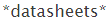

# Inhoudspatronen maken {#create-content-patterns}

Wanneer u inhoudspatronen instelt, wordt inhoud automatisch gedetecteerd wanneer een webbezoeker op de HTML-webpagina klikt die relevant is voor het inhoudspatroon. Hiermee worden HTML-pagina&#39;s (blogberichten, persberichten, nieuwsartikelen) toegevoegd als inhoudsonderdelen op de pagina Alle inhoud. Wanneer automatische detectie is gebaseerd op inhoudspatronen, worden HTML-pagina&#39;s die verwant zijn aan het gedefinieerde URL-patroon, opgespoord en bijgehouden wanneer een webbezoeker een koppeling naar de pagina weergeeft of klikt. Dit inhoudsonderdeel (de URL, de paginanaam en de metagegevens inclusief de URL en beschrijving van de afbeelding) wordt toegevoegd aan de pagina Alle inhoud om voorspellende inhoud voor te bereiden. Voor auto-ontdekt andere inhoud, zoals PDFs en ingebedde video, moet u [ inhouds ontdekking ](/help/marketo/product-docs/predictive-content/getting-started/enable-content-discovery.md) toelaten.

1. Ga naar **[!UICONTROL Content Settings]** .

   

1. Klik op **[!UICONTROL URL Patterns]**.

   

1. Klik op **+** om een rij te openen waarin u uw gegevens kunt invoeren.

   

1. Voeg de URL-extensie toe van het domein waar de webpagina bestaat. Selecteer de categorie (bijvoorbeeld [!UICONTROL Blog] , [!UICONTROL Article] , [!UICONTROL Data Sheet] , [!UICONTROL Press Release] ).

   

   >[!NOTE]
   >
   >De punten in de drop-down lijst op het recht wijzen op de categorieën u opstelling wanneer u [ categorieën ](/help/marketo/product-docs/predictive-content/getting-started/set-up-categories.md) creeerde.

1. Klik op **+** om een ander pad toe te voegen.

   

1. Voeg de extensie en categorie voor het extra pad toe en klik op **[!UICONTROL Save]** .

   

## Regels voor inhoudspatronen {#content-pattern-rules}

* U kunt een vervanging overal in een uitdrukking gebruiken (Voorbeeld: _domain.com/&#42;_, _domain.com/&#42; blog&#42;_)

* Wij adviseren gebruikend /&#42; aan het eind van een uitdrukking om patroonontdekking (Voorbeeld: _domain.com/blog/&#42;_ ontdekt alle posten in de omslag van het Blog) voort te zetten
* De patronen van de inhoud zijn niet gevoelig geval (Voorbeeld: _domain.com/Blog/&#42;_ ontdekt alle HTML- pagina&#39;s op _domain.com/Blog_ en _domain.com/blog_)

* URL-parameters worden niet gedetecteerd (dit voorkomt het detecteren van meerdere items met dezelfde URL voor inhoud, maar met verschillende parameters)

## Voorbeelden {#examples}

Voor _domain.com_:

<table>
 <tbody>
  <tr>
   <th>URL-patroon</th>
   <th>Resultaat</th>
  </tr>
  <tr>
   <td>blog/*</td>
   <td>
Alle inhoud met het patroon domain.com/blog/:

domain.com/blog/5-top-tricks

domain.com/blog/2017/new-year-solutions

domain.com/Blog/3-best-recipes
</td>
  </tr>
  <tr>
   <td>artikel 2017/*</td>
   <td>
Alle inhoud met het patroon domain.com/article/2017/:

domain.com/article/2017/5-top-tricks
</td>
  </tr>
  <tr>
   <td></td>
   <td>
Ontdekt om het even welke URL die het woord "datasheets bevat:"

domain.com/datasheets/5-top-tricks

domain.com/blog/5-top-datasheets
</td>
  </tr>
  <tr>
   <td>persbericht</td>
   <td>
Er is slechts één exact overeenkomende HTML-pagina gevonden:

domain.com/press-release
</td>
  </tr>
  <tr>
   <td colspan="1"> </td>
   <td colspan="1">
Als de URL-expressie leeg is, wordt met het URL-patroon alleen de startpagina gedetecteerd:

domain.com
</td>
  </tr>
 </tbody>
</table>
