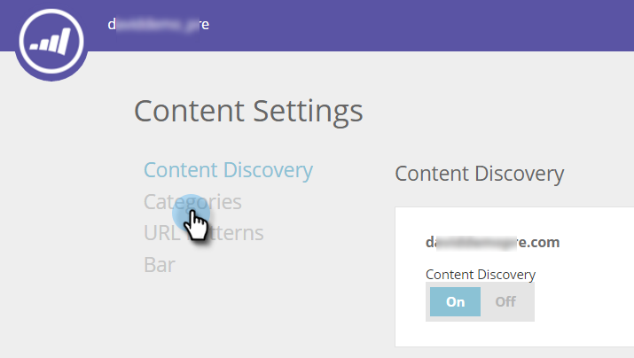

# Categorieën instellen {#set-up-categories}

Maak categorieën in voorspellende inhoud om uw voorspellende resultaten te groeperen op internet of in e-mail. U kunt bijvoorbeeld alleen werken met blogs of met inhoud in een bepaalde taal. U kunt hiermee ook de paginaweergave zoeken en filteren.  Categorieën worden ter referentie weergegeven op de pagina&#39;s Alle inhoud en Voorspelende inhoud.

Wanneer u ontdekte inhoud bewerkt, voegt u categorieën toe in het bewerkingsscherm. Klik op de knop **Categorieën** en selecteer deze in de vervolgkeuzelijst.

Wanneer u inhoud toevoegt, kunt u er tags aan toewijzen met de categorieën die in het pop-upmenu zijn geselecteerd.

## Categorietags maken {#create-category-tags}

Hieronder wordt beschreven hoe u categorietags maakt.

1. Ga naar **Inhoudsinstellingen**.

   

1. Klikken **Categorieën**.

   

1. Bestaande categorietags worden weergegeven. Voer een nieuwe categorietag in en klik op **Nieuw maken**.

   

1. U kunt een categorietag verwijderen door te klikken **x** naast het.

   

1. Klikken **Opslaan** als je klaar bent.

   

   Heel eenvoudig.
