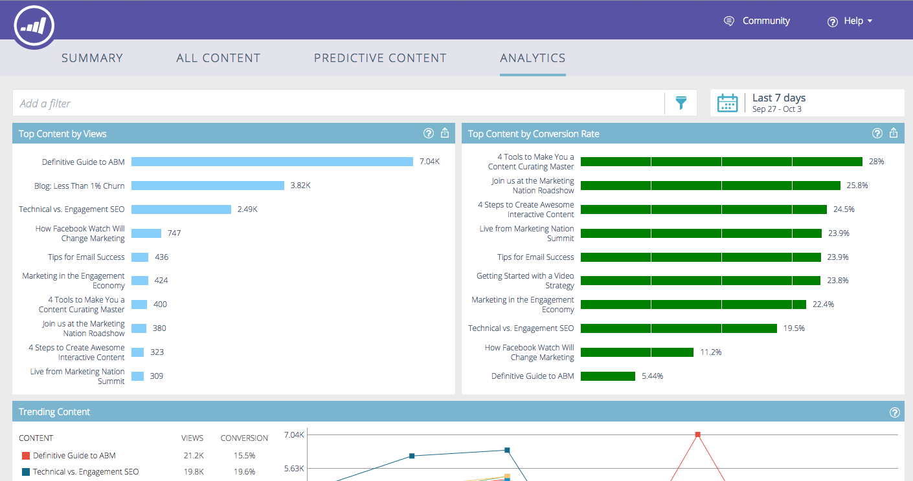
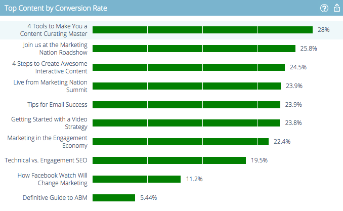

# Voorspelend Content Analytics-overzicht {#predictive-content-analytics-overview}

Gebruik de inhoudanalyse om meer inzicht te krijgen in uw bestaande inhoud, om te leren (op basis van AI- en voorspellende algoritmen) welke inhoud geschikt is voor uw publiek en om uw rendement te verhogen bij uw marketingactiviteiten.

>[!NOTE]
>
>De eigenschappen tab en content analytics van [!UICONTROL Analytics] zijn uitsluitend beschikbaar bij Marketo Predictive Content.

## Overzicht {#overview}

Klik op de pagina Samenvatting op **[!UICONTROL Analytics]** .

[!UICONTROL Analytics] bestaat uit verschillende secties: [!UICONTROL Top Content by Views] , [!UICONTROL Top Content by Conversion Rate] , [!UICONTROL Trending Content] , [!UICONTROL Suggested Content] en [!UICONTROL Content] .

Houd de muisaanwijzer boven het vraagteken in de koptekst van een sectie voor meer informatie.

Klik op de knop Exporteren om de resultaten van die sectie te exporteren via Excel.

U kunt resultaten filteren op verschillende kenmerken/eigenschappen (bijvoorbeeld [!UICONTROL ABM Account List] , [!UICONTROL Country] , enz.).

Klik op het kalenderpictogram om de datums van de gereflecteerde gegevens te wijzigen. Kies een vooraf ingestelde hoeveelheid tijd of een specifiek datumbereik.

## [!UICONTROL Top Content by Views] {#top-content-by-views}

Hiermee geeft u de bovenste inhoudselementen weer op basis van het aantal weergaven per geselecteerd datumbereik.

## [!UICONTROL Top Content by Conversion Rate] {#top-content-by-conversion-rate}

Hiermee geeft u de bovenste conversie-inhoud weer aan de hand van de conversiesnelheid voor het geselecteerde datumbereik.

>[!NOTE]
>
>**Definitie**
>
>**Tarief van de Omzetting**: Een percentage dat door directe omzettingen wordt berekend die door kliks worden verdeeld.

## [!UICONTROL Trending Content] {#trending-content}

Geeft de populariteit van een inhoudsstuk weer door te kijken naar de laatste twee weken grotere weergaven in vergelijking met dezelfde voorgaande periode.

## [!UICONTROL Suggested Content] {#suggested-content}

Geeft de inhoud weer die u in uw marketingactiviteiten wilt promoten op basis van het filter dat u hebt gedefinieerd.

Houd de muisaanwijzer boven een afbeelding in Inhoud met suggesties om de beschikbare opties weer te geven.

>[!NOTE]
>
>Zie je die pictogrammen onderaan? Van links naar rechts zijn ze: [!UICONTROL View Content], [!UICONTROL Export to CSV], [!UICONTROL Approve Content] .

## [!UICONTROL Content] {#content}

Zoek naar het gewenste inhoudsstuk en klik het om extra details te zien, met inbegrip van: de bezoekers die het bekijken, nieuw tegenover het terugkeren, gekend en anoniem, de hoogste plaatsen de bezoekers van toen het bekijken van de inhoud kwamen, en de hoogste afgeleide industrieën zij uit komen.

>[!NOTE]
>
>De gelijkaardige inhoud wordt gebaseerd op het geselecteerde inhoudsstuk en door een algoritme van de verenigingsregels berekend. De resultaten vertegenwoordigen inhoudsonderdelen waarop bezoekers waarschijnlijk zullen klikken, afhankelijk van het geselecteerde stuk en het gedrag van de bezoeker. Hierbij wordt geen rekening gehouden met het filter of datumbereik.
