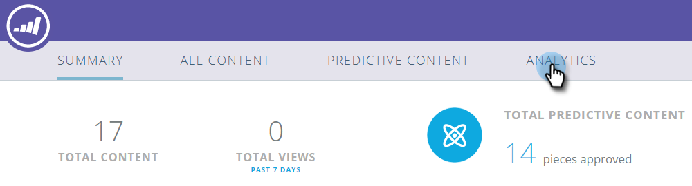

# Het overzicht met voorspellende inhoud {#the-predictive-content-summary}

In het overzicht met voorspellende inhoud wordt in één oogopslag de informatie weergegeven die u nodig hebt over uw voorspellende inhoud, met tabellen, grafieken en huidige getallen.

## Bovenste balk {#top-bar}

Op de bovenste balk ziet u de huidige nummers voor de inhoud en de weergaven, en hoeveel delen zijn ingeschakeld. Selecteer een weergave van de afgelopen 7 of 30 dagen voor de gehele pagina in de rechterbovenhoek.

## Prestatietabel {#performance-table}

Hier zie je je top 10 van ontdekte inhoud, inclusief weergaven, directe leads en conversiesnelheid.

## [!UICONTROL Predictive Engagement] {#predictive-engagement}

Bekijk de conversiesnelheid door de totale kliks en directe leads te vergelijken en de prestaties van de verschillende bronnen te vergelijken.

## [!UICONTROL Content Trend by Views]  {#content-trend-by-views}

Vergelijk hoe uw meningen van al inhoud met uw vooruitlopende inhoud aanpassen.

## [!UICONTROL Top Categories by Engagement] {#top-categories-by-engagement}

Welke inhoudscategorieën zijn het meest aantrekkelijk? Zie het in deze grafiek.

>[!NOTE]
>
>Als u op een categoriekoppeling klikt (voorbeelden in de bovenstaande afbeelding: leadgen, e-mail, enz.), wordt de pagina Alle inhoud geopend met de categorie waarop u hebt geklikt, toegevoegd aan het filter. De inhoudanalyse wordt in die categorie weergegeven.
