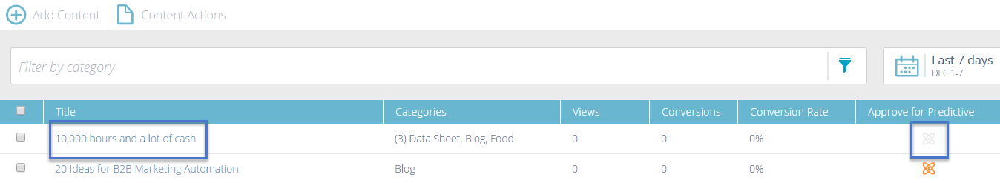

# Nieuwe inhoud toevoegen {#add-new-content}

U kunt inhoud eenvoudig handmatig toevoegen aan de [!UICONTROL All Content] -pagina.

1. Klik op de vervolgkeuzelijst **[!UICONTROL Add Content]** en selecteer **[!UICONTROL Add Content]** .

   

1. Voer desgewenst een titel en URL in en een afbeeldings-URL.

   

1. Als u categorieën wilt toevoegen, klikt u op het veld en selecteert u een van de gewenste categorieën in de vervolgkeuzelijst.

   

1. Klik op **[!UICONTROL Add]**.

   

1. De nieuwe titel wordt nu weergegeven op de pagina **[!UICONTROL All Content]** . Merk op dat het nog niet voor voorspellende inhoud is goedgekeurd.

   

1. Hier is hoe te om het aan [ Voorspelende Inhoud ](/help/marketo/product-docs/predictive-content/working-with-all-content/approve-a-title-for-predictive-content.md) toe te voegen.
