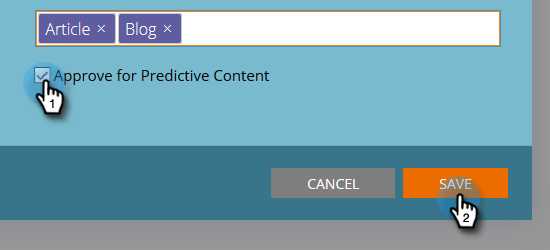

# Inhoud bewerken {#edit-content}

Je kunt bepaalde bewerkingen uitvoeren op aanbiedingen op de [!UICONTROL All Content] pagina.

1. Houd de muisaanwijzer boven de rij van de titel die u wilt bewerken op de pagina **[!UICONTROL All Content]** en klik op het pictogram Bewerken.

   

1. Breng wijzigingen aan in het selectievakje [!UICONTROL Content Name] en [!UICONTROL Content URL] (het selectievakje voor queryparameters is optioneel).

   

1. Klik op het veld **[!UICONTROL Categories]** om categorieën toe te voegen of te verwijderen. Selecteer nieuwe in het keuzemenu. U kunt een momenteel geselecteerde categorie verwijderen door zijn **X** te klikken.

   

1. Schakel het selectievakje **[!UICONTROL Approve for Predictive Content]** in om goed te keuren of schakel het selectievakje uit om de goedkeuring ongedaan te maken. Klik op **[!UICONTROL Save]** als u klaar bent.

   
