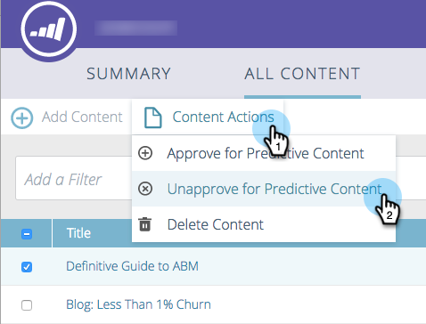
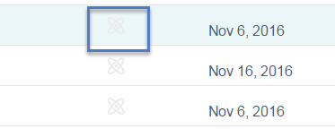

# De goedkeuring van een titel voor [!UICONTROL Predictive Content] opheffen {#unapprove-a-title-for-predictive-content}

U kunt elke titel voor voorspellende inhoud op de [!UICONTROL All Content] -pagina of in het pop-upmenu [!UICONTROL Edit Content] opheffen.

## [!UICONTROL All Content] Pagina {#all-content-page}

1. Schakel op de pagina [!UICONTROL All Content] het vakje naast het stuk inhoud in om het te selecteren.

   

1. Klik op de vervolgkeuzelijst **[!UICONTROL Content Actions]** en selecteer **[!UICONTROL Unapprove for Predictive Content]** .

   

## [!UICONTROL Edit Content] Pop-up {#edit-content-pop-up}

U kunt een titel verwijderen terwijl u deze bewerkt.

1. Houd de muisaanwijzer boven een stuk inhoud en klik op het pictogram Bewerken aan het einde van de rij.

   

1. Schakel het selectievakje **[!UICONTROL Approve for Predictive Content]** uit en klik op **[!UICONTROL Save]** .

   

Ongeacht de methode die u gebruikt, gaat het goedkeuringspictogram naar de pagina [!UICONTROL All Content] en verdwijnt de titel van de pagina [!UICONTROL Predictive Content] .

