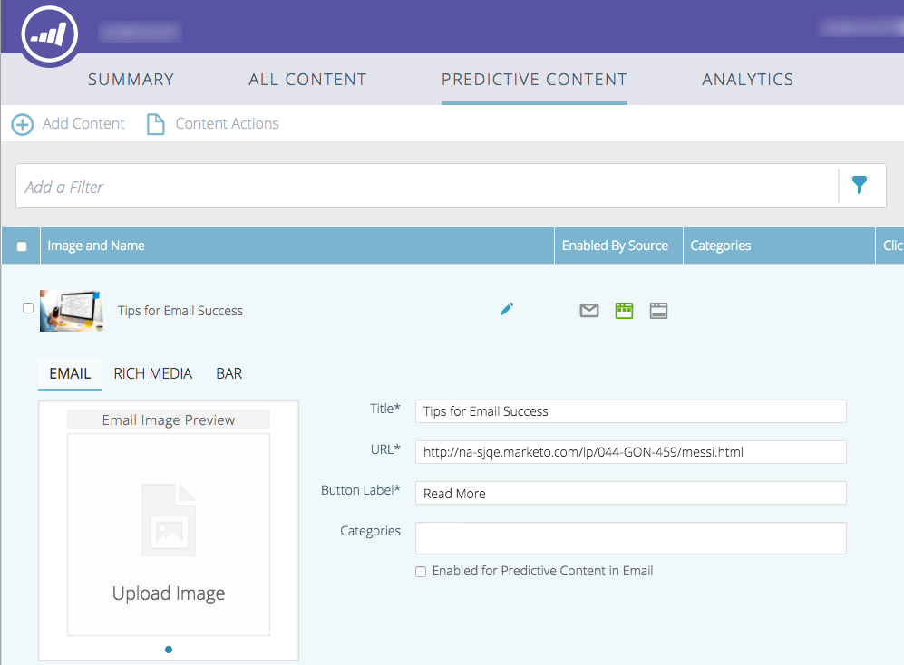

# Voorspelende inhoud voor e-mails bewerken {#edit-predictive-content-for-emails}

>[!NOTE]
>
>Afhankelijk van de aankoopdatum kan uw abonnement op Marketo de optie Voorspelende inhoud of Inhoud`AI`markeren bevatten. Marketo schakelt de functie Content`AI` Analytics voor gebruikers die gebruikmaken van voorspellende inhoud in tot 30 april 2018. Als u deze functies na die datum wilt behouden, neemt u contact op met de manager Succes bij Marketo-klanten om te upgraden naar Marketo-inhoud`AI`.

Hier volgt hoe u uw voorspellende inhoud instelt voor e-mails.

>[!PREREQUISITES]
>
>Inhoud moet worden [goedgekeurd voor voorspellende inhoud](/help/marketo/product-docs/predictive-content/working-with-all-content/approve-a-title-for-predictive-content.md) op de pagina Alle inhoud.

1. Klik op de pagina Voorspelende inhoud op een titel om de editor te openen.

   

1. De bewerkingspagina wordt geopend. **E-mailweergaven** worden standaard weergegeven.

   

   >[!NOTE]
   >
   >De titel en de URL zijn al ingevuld. Controleer of ze zijn wat je wilt.

1. Typ het tekstvak rechts van het knoplabel om het knoplabel toe te voegen of te bewerken.

   

   >[!NOTE]
   >
   >Als u het knoplabel hebt gewijzigd, wordt dit bijgewerkt wanneer u de wijzigingen opslaat of een voorvertoning van de afbeelding weergeeft.

1. Klik op Afbeelding **** bewerken om de URL van de afbeelding toe te voegen of te bewerken.

   

1. Voeg de URL van de afbeelding in en klik op **Toevoegen**.

   

1. Klik en sleep de schuifregelaar om de afbeeldingsgrootte te wijzigen. Klik en sleep het uitsnijdvak om het gewenste afbeeldingsgebied te isoleren. Klik op **Voorvertoning** als u klaar bent.

   

1. Klik op de pijlen aan de zijkanten om door de inhoud te bladeren en deze weer te geven in elk voorbeeld van de e-maillay-out (er worden twee opties weergegeven).

   |  |  |
   |---|---|

1. Klik indien nodig op het veld **Categorieën** en voeg categorieën toe aan de inhoud. De opties zijn afkomstig uit de [categorieën die u al hebt ingesteld](/help/marketo/product-docs/predictive-content/getting-started/set-up-categories.md).

   

1. Schakel het selectievakje in om voorspellende inhoud in e-mail in te schakelen.

   

1. Klik op **Opslaan**.

   

   >[!NOTE]
   >
   >In Marketo Email Editor v2.0 kunt u ook de lay-outsjablonen  weergeven terwijl u de inhoud inschakelt.
