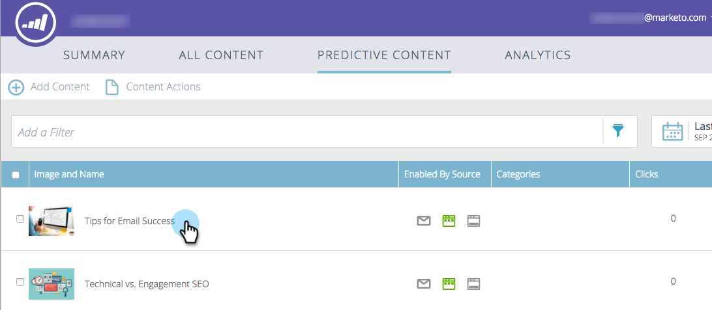

# Voorspelende inhoud voor e-mails bewerken {#edit-predictive-content-for-emails}

Hier volgt hoe u uw voorspellende inhoud instelt voor e-mails.

>[!PREREQUISITES]
>
>De inhoud moet [&#x200B; voor vooruitlopende inhoud &#x200B;](/help/marketo/product-docs/predictive-content/working-with-all-content/approve-a-title-for-predictive-content.md) op de [!UICONTROL All Content] pagina worden goedgekeurd.

1. Klik op de pagina [!UICONTROL Predictive Content] op een titel om de editor te openen.

   

1. De bewerkingspagina wordt geopend. **[!UICONTROL Email]** wordt standaard weergegeven.

   

   >[!NOTE]
   >
   >De titel en de URL zijn al ingevuld. Controleer of ze zijn wat je wilt.

1. Typ het tekstvak rechts van het knoplabel om het knoplabel toe te voegen of te bewerken.

   

   >[!NOTE]
   >
   >Als u het knoplabel hebt gewijzigd, wordt dit bijgewerkt wanneer u de wijzigingen opslaat of een voorvertoning van de afbeelding weergeeft.

1. Klik op **[!UICONTROL Edit Image]** om de URL van de afbeelding toe te voegen of te bewerken.

   

   >[!CAUTION]
   >
   >Voor de beste kwaliteit moet de afbeelding 400 x 400 pixels of kleiner zijn.

1. Voeg de URL van de afbeelding in en klik op **[!UICONTROL Add]** .

   

1. Klik en sleep de schuifregelaar om de afbeeldingsgrootte te wijzigen. Klik en sleep het uitsnijdvak om het gewenste afbeeldingsgebied te isoleren. Klik op **[!UICONTROL Preview]** als u klaar bent.

   

1. Klik op de pijlen aan de zijkanten om door de inhoud te bladeren en deze weer te geven in elk voorbeeld van de e-maillay-out (er worden twee opties weergegeven).

   |  |  |
   |---|---|

1. Klik indien nodig op het veld **[!UICONTROL Categories]** en voeg categorieën toe aan de inhoud. De opties zijn van de [&#x200B; categorieën u reeds opstelling &#x200B;](/help/marketo/product-docs/predictive-content/getting-started/set-up-categories.md) hebt.

   

1. Schakel het selectievakje in om voorspellende inhoud in e-mail in te schakelen.

   

1. Klik op **[!UICONTROL Save]**.

   

   >[!NOTE]
   >
   >In Marketo E-mailredacteur v2.0, kunt u de lay-outmalplaatjes [&#x200B; ook bekijken u gebruikt terwijl u de inhoud toelaat.](/help/marketo/product-docs/predictive-content/enabling-predictive-content/enable-predictive-content-in-emails.md)
