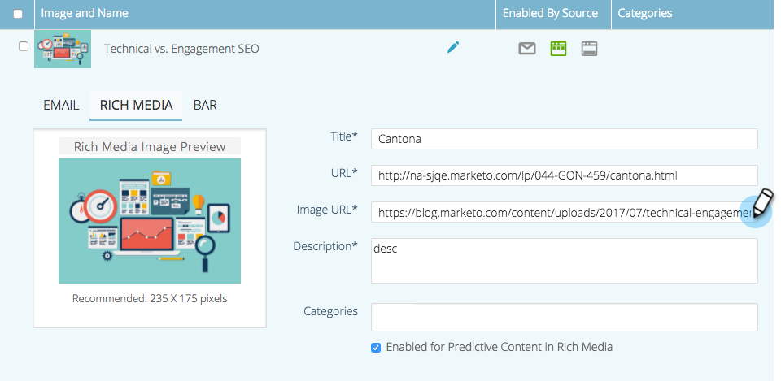

# Predictieve inhoud voor rijke media bewerken {#edit-predictive-content-for-rich-media}

Hier is hoe te opstelling uw vooruitlopende inhoud voor Rijke Media.

>[!PREREQUISITES]
>
>Inhoud moet [goedgekeurd voor voorspellende inhoud](/help/marketo/product-docs/predictive-content/working-with-all-content/approve-a-title-for-predictive-content.md) op de pagina Alle inhoud.

1. Op de **Voorspelende inhoud** klikt u op een titel om de editor te openen.

   

1. Klikken **Rijke media**.

   

1. U zult zien dat u aparte afbeeldingen voor e-mail en rijke media kunt hebben. Als u de afbeelding wilt toevoegen of wijzigen, plakt u de URL van de afbeelding in het tekstvak.

   

1. Tekst in een **Beschrijving**.

   

1. Klik op de knop **Categorieën** te selecteren/toe te voegen [rubrieken die je al hebt ingesteld](/help/marketo/product-docs/predictive-content/getting-started/set-up-categories.md) (optioneel).

   

   >[!NOTE]
   >
   >Gebruik categorieën om inhoud voor een specifieke Rich Media- aanbevelingen malplaatje te groeperen. Laat de categorie leeg om de inhoud toe te passen op alle aanbevolen sjablonen (aanbevolen).
   >
   >Nochtans, als u slechts specifieke inhoud voor een Rich Media malplaatje wilt adviseren, voeg een categorie voor de inhoud toe en associeer die categorie met het aanbevelingsmalplaatje.
   >
   >U kunt bijvoorbeeld relevante inhoud categoriseren op basis van secties op uw website (producten of oplossingen).

1. Schakel het selectievakje in om voorspellende inhoud in rijke media in te schakelen.

   

1. Klikken **Opslaan**.

   
