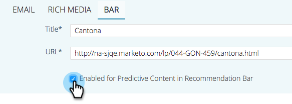
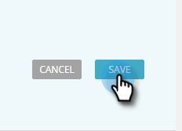

# Voorspelende inhoud voor de balk met aanbevelingen bewerken {#edit-predictive-content-for-the-recommendation-bar}

Hier is hoe te opstelling uw vooruitlopende inhoud voor de Bar van de Aanbeveling.

>[!PREREQUISITES]
>
>De inhoud moet [ voor vooruitlopende inhoud ](/help/marketo/product-docs/predictive-content/working-with-all-content/approve-a-title-for-predictive-content.md) op de Al pagina van de Inhoud worden goedgekeurd.

1. Klik op de pagina **[!UICONTROL Predictive Content]** op een titel om de editor te openen.

   

1. Klik op **[!UICONTROL Bar]**.

   

1. Schakel het selectievakje in om voorspellende inhoud in te schakelen op de balk met aanbevelingen.

   

1. Klik op **[!UICONTROL Save]**.

   
