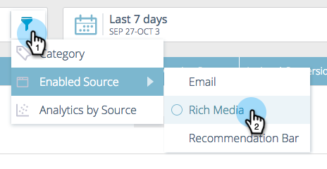
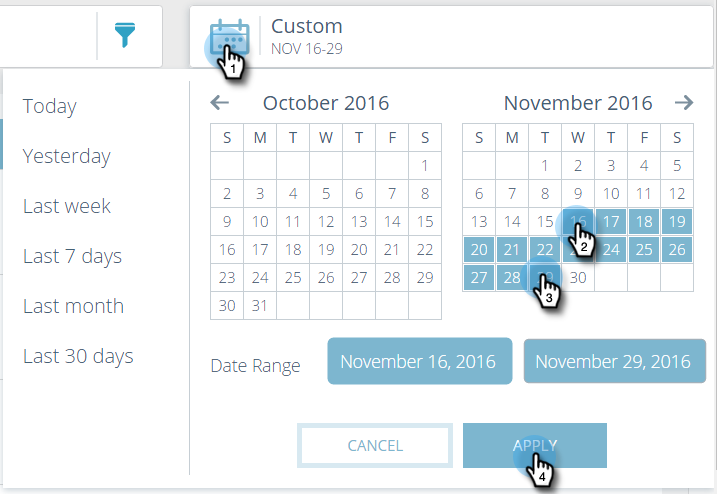

# Voorspelende inhoud {#understanding-predictive-content}

Nadat u [ een titel voor vooruitlopende inhoud ](/help/marketo/product-docs/predictive-content/working-with-all-content/approve-a-title-for-predictive-content.md) goedkeurt, werkt u hier aan het. Op de pagina [!UICONTROL Predictive Content] worden alle titels weergegeven die u hebt goedgekeurd voor voorspellende inhoud.

Paginavelden zijn:

* **[!UICONTROL Image and Name]**: De naam van het stuk inhoud en de geselecteerde afbeelding
* **[!UICONTROL Enabled by Source]**: Hiermee kunt u zien of de titel is goedgekeurd voor veelzijdige media, e-mail of de balk met aanbevelingen.
* **[!UICONTROL Categories]**: door u gemaakt en gebruikt om uw voorspellende resultaten voor web of e-mail te groeperen
* **[!UICONTROL Clicks]**: klik in totaal op aanbevolen inhoud (inclusief alle bronnen)
* **[!UICONTROL Conversion Rate]**: Een percentage dat wordt berekend door directe omzettingen gedeeld door klikken. Houd de muisaanwijzer boven aanvullende gegevens (zie hieronder)
* **[!UICONTROL Assisted Conversion]**: Bezoekers die tijdens een vorig bezoek op aanbevolen inhoud hebben geklikt en later een formulier hebben ingevuld

## Inhoud filteren {#filtering-content}

**[!UICONTROL Category]**

U kunt inhoud filteren op categorieën die u hebt gemaakt. Klik op het filterpictogram en selecteer onder **[!UICONTROL Category]** een of meer inhoudscategorieën.

**[!UICONTROL Enabled Source]**

Filter op elk type ingeschakelde inhoud: [!UICONTROL Email], [!UICONTROL Rich Media], [!UICONTROL Recommendation Bar] .

**[!UICONTROL Analytics by Source]**

Door de analyse van ingeschakelde inhoud te filteren, kunt u zien hoe elke bron presteert.

## Analyses weergeven op datum {#display-analytics-by-date}

1. Selecteer de begin- en einddatum aan de rechterkant (zoals weergegeven). Klik op **[!UICONTROL Apply]**.

   

## Tabelgegevens voor voorspellende inhoud weergeven {#view-table-data-for-predictive-content}

In de lijst, kunt u bekijken welke bronnen voor voorspelbare inhoud, van links tot rechts worden toegelaten: de Bar van de Aanbeveling, e-mail, en rijke Media. Ingeschakelde bronnen worden groen weergegeven. U schakelt deze in wanneer u de inhoud bewerkt.

Houd de cursor boven de balk in de kolom [!UICONTROL Conversion Rate] om de conversiesnelheid, de directe conversie en aangeklikte gegevens weer te geven.

>[!NOTE]
>
>**Definities**
>
>**[!UICONTROL Conversion Rate]**: Een percentage dat wordt berekend door directe conversies gedeeld door klikken
>
>**[!UICONTROL Direct Conversion]**: Bezoekers die op aanbevolen inhoud hebben geklikt en tijdens hetzelfde bezoek een formulier hebben ingevuld
>
>**[!UICONTROL Clicked]**: klik in totaal op de aanbevolen inhoud (inclusief alle drie de bronnen)
