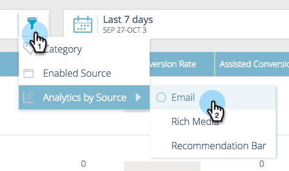

# Voorspelende inhoud {#understanding-predictive-content}

>[!NOTE]
>
>Afhankelijk van de aankoopdatum kan uw abonnement op Marketo de optie Voorspelende inhoud of Inhoud`AI`markeren bevatten. Marketo schakelt de functie Content`AI` Analytics voor gebruikers die gebruikmaken van voorspellende inhoud in tot 30 april 2018. Als u deze functies na die datum wilt behouden, neemt u contact op met de manager Succes bij Marketo-klanten om te upgraden naar Marketo-inhoud`AI`.

Nadat je een titel voor voorspellende inhoud [hebt](//help/marketo/product-docs/predictive-content/working-with-all-content/approve-a-title-for-predictive-content.md)goedgekeurd, werk je er hier aan. Op de pagina Voorspelende inhoud worden alle titels weergegeven die u hebt goedgekeurd voor voorspellende inhoud.

Paginavelden zijn:

* **Afbeelding en titel**: De naam van de inhoud en de geselecteerde afbeelding
* **Ingeschakeld op bron**: Toont of de titel voor Rijke Media, e-mail, of de Bar van de Aanbeveling wordt goedgekeurd.
* **Categorieën**: Gemaakt door jou en gebruikt om je voorspellende resultaten te groeperen voor web of e-mail
* **Klik**: Totale klik op aanbevolen inhoud (inclusief alle bronnen)
* **Conversiesnelheid**: Een percentage dat wordt berekend door middel van directe omzettingen gedeeld door klikken. Houd de muisaanwijzer boven aanvullende gegevens (zie hieronder)
* **Ondersteunde conversie**: Bezoekers die tijdens een vorig bezoek op aanbevolen inhoud hebben geklikt en later een formulier hebben ingevuld

## Inhoud filteren {#filtering-content}

**Categorie**

U kunt inhoud filteren op categorieën die u hebt gemaakt. Klik op het filterpictogram en selecteer onder **Categorie** een of meer inhoudscategorieën.

**Ingeschakelde bron**

Filteren op elk type ingeschakelde inhoud: E-mail, rijke media, de bar van de Aanbeveling.

**Analyse op bron**

Door de analyse van ingeschakelde inhoud te filteren, kunt u zien hoe elke bron presteert.

## Analyses weergeven op datum {#display-analytics-by-date}

1. Selecteer de begin- en einddatum aan de rechterkant (zoals weergegeven). Klik op **Toepassen**.

   

## Tabelgegevens voor voorspellende inhoud weergeven {#view-table-data-for-predictive-content}

In de tabel kunt u zien welke bronnen zijn ingeschakeld voor voorspellende inhoud, van links naar rechts: De Bar van de aanbeveling, e-mail, en rijke Media. Ingeschakelde bronnen worden groen weergegeven. U schakelt deze in wanneer u de inhoud bewerkt.

Houd de muisaanwijzer boven de balk in de kolom Conversiesnelheid om de conversiesnelheid, de directe conversie en aangeklikte gegevens weer te geven.

>[!NOTE]
>
>**Definities**
>
>**Conversiesnelheid**: Een percentage berekend door middel van directe omzettingen gedeeld door klikken
>
>**Directe omzetting**: Bezoekers die op aanbevolen inhoud hebben geklikt en tijdens hetzelfde bezoek een formulier hebben ingevuld
>
>**Klik**: Het totale klikken op geadviseerde inhoud (met inbegrip van alle drie bronnen)

>[!MORELIKETHIS]
>
>* [Voorspelende inhoud](http://docs.marketo.com/display/docs/predictive+content)
>* [Voorspelende inhoud bewerken](http://docs.marketo.com/display/docs/edit+predictive+content)

