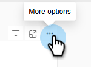

# Advanced BI Analytics - overzicht {#advanced-bi-analytics-overview}

Advanced BI Analytics (voorheen bekend als Revenue Explorer en Advanced Report Builder) biedt een flexibele rapportage- en visualisatie-interface voor Marketo Engage-gegevens, die gedetailleerde informatie biedt over progressie, prestaties en nog veel meer. Deze server biedt een rijkere interactiviteit en visualisatie, snellere prestaties en een naadloze en intuïtievere gebruikerservaring.

Deze verbeteringen helpen u tijd te besparen, waardevolle inzichten te ontdekken, optimalisatie te drijven, en meer dwingende gegevensverhalen met collega&#39;s en belanghebbenden te delen.

>[!PREREQUISITES]
>
>Voor toegang tot deze functie moet u de add-on Advanced BI Analytics hebben aangeschaft. Neem contact op met het Adobe-accountteam (uw accountmanager) voor meer informatie.

## Belangrijkste kenmerken en voordelen {#key-features-and-benefits}

* **Krachtige Motor van de Vraag**: Levert 5x snellere prestaties op grote datasets, toelatend snellere gegevensverwerking, snellere rapportlading, en een vlottere analytische ervaring.

* **Rich en het Inschakelen Visualisatie**: Vast, uitgebreide inzameling van ingebouwde visualisatieopties, met inbegrip van grafieken, kaarten, en KPI indicatoren, die dashboards begrijpelijker en impactful maken en beduidend gegevensverhaal verbeteren.

* **Geavanceerde Interactiviteit en het Dynamische Filtreren**: Pas dynamische plakken, dwars-filtreren, en onderling afhankelijke filters over visuals toe. Rapporten met meerdere pagina&#39;s ondersteunen geavanceerde mogelijkheden voor het uitboren, doorboren en doorboren, zodat u probleemloos gegevens kunt verkennen.

* **Intuïtieve Interface van de Authoring van het Rapport**: Een punt-en-klik ervaring vereenvoudigt rapportverwezenlijking, met inbegrip van multi-pagina boor-door rapporten. De interface stelt gebruikers in staat complexe, interactieve rapporten te ontwerpen zonder uitgebreide technische expertise te vereisen.

* **Gemakkelijk delen, met inbegrip van de Uitvoer van PowerPoint**: De ingebouwde delende functionaliteit maakt het delen van inzichten zonder moeite. Gebruikers kunnen onder andere eenvoudig PowerPoint-dia&#39;s voor presentaties genereren.

## Een rapport maken {#create-a-report}

1. Klik in Mijn Marketo op de tegel **[!UICONTROL Advanced BI Analytics]** .

   {width="800" zoomable="yes"}

1. Klik op het tabblad **[!UICONTROL Reports]** op **[!UICONTROL Create Report]** .

   {width="800" zoomable="yes"}

1. Selecteer de gewenste maatregelen.

   {width="800" zoomable="yes"}

1. Selecteer de gewenste afmetingen.

   {width="800" zoomable="yes"}

1. Kies uw gewenste visualisatie.

   {width="800" zoomable="yes"}

1. Voeg filters toe door een dimensiekenmerk te slepen en neer te zetten.

   {width="800" zoomable="yes"}

## Een rapport exporteren {#export-a-report}

Wanneer u een volledig rapport exporteert, zijn de exportopties PDF en PPT. Als u uw gegevens in .XLS of .CSV nodig hebt, kunt u dit doen door individuele visualisaties uit te voeren ([ zie hieronder ](#export-a-visualization)).

>[!BEGINTABS]

>[!TAB  van de pagina van Rapporten ]

1. Voor de pagina van Rapporten, klik het &quot;meer&quot;pictogram (...) van het gewenste rapport en selecteer **Uitvoer**.

   

1. Kies PDF of PPT en klik **Uitvoer**.

   

>[!TAB  binnen het rapport ]

1. Binnen het rapport zelf, klik het &quot;meer&quot;pictogram (**...**) op het hoger-recht en selecteer **Uitvoer**.

   

1. Kies PDF of PPT en klik **Uitvoer**.

   

>[!ENDTABS]

### Een visualisatie exporteren {#export-a-visualization}

Leer hoe u specifieke gedeelten van uw rapport exporteert.

1. Kies het gewenste rapport.

   {width="600" zoomable="yes"}

1. Houd de muis boven de weergegeven visualisatie om drie pictogrammen weer te geven.

   {width="600" zoomable="yes"}

1. Klik op het pictogram &#39;Meer&#39; (**...**)

   

1. Selecteer **Gegevens van de Uitvoer**.

   

1. Kies de gewenste gegevensindeling.

   

   >[!NOTE]
   >
   >* _Gegevens met huidige lay-out_ is slechts beschikbaar voor lijst en matrixbeelden.
   >* _Onderliggende gegevens_ is niet beschikbaar in Marketo Engage.

1. Kies de gewenste bestandsindeling (.XLS, .CSV).

   

1. Klik **Uitvoer**.

## Videodemo {#video}

Bekijk de volgende video om een voorbeeld van een drill-through rapportervaring van meerdere pagina&#39;s te zien.

>[!VIDEO](https://video.tv.adobe.com/v/3451688/?quality=12&learn=on&captions=dut){transcript=true}

## Standaardrapporten in Advanced BI Analytics {#standard-reports}

De volgende standaardrapporten worden als voorbeelden voor uw douanerapporten opgenomen.

<table>
  <thead>
    <tr>
      <th>Rapportgebied</th>
      <th>Rapportnaam</th>
    </tr>
  </thead>
  <tbody>
    <tr>
      <td rowspan="8">E-mailanalyse</td>
      <td>E-mail - Verzonden activiteit (in CST)</td>
    </tr>
    <tr>
      <td>E-mail - Klik Activiteit (in CST)</td>
    </tr>
    <tr>
      <td>E-mail - Open Activiteit (in CST)</td>
    </tr>
    <tr>
      <td>E-mail - Geplikte Tijddistributie (in CST)</td>
    </tr>
    <tr>
      <td>E-mail - Verval voor Open Rate</td>
    </tr>
    <tr>
      <td>E-mail - Opened Time Distribution (in CST)</td>
    </tr>
    <tr>
      <td>E-mail - Prestatiegegevens</td>
    </tr>
    <tr>
      <td>E-mail - klik Verval van Tarief</td>
    </tr>
    <tr>
      <td rowspan="8">Analyse van lead</td>
      <td>De 10 belangrijkste bronnen op geconverteerde leads</td>
    </tr>
    <tr>
      <td>Meest gebruikte 10 lead-bronnen</td>
    </tr>
    <tr>
      <td>SLA Infractions Report</td>
    </tr>
    <tr>
      <td>Rapport Leadveroudering</td>
    </tr>
    <tr>
      <td>Balansrapport lead</td>
    </tr>
    <tr>
      <td>Conversierapport voor lead</td>
    </tr>
    <tr>
      <td>Rapport voor lead flow</td>
    </tr>
    <tr>
      <td>Tijdrapport voor lead-overgang</td>
    </tr>
    <tr>
      <td rowspan="5">Programmaanalyse</td>
      <td>De tien belangrijkste programma's zijn geslaagd</td>
    </tr>
    <tr>
      <td>Top 10 van programma's door totale pijpleiding</td>
    </tr>
    <tr>
      <td>Verslag over de omzettingsfase van het programma</td>
    </tr>
    <tr>
      <td>Meest gebruikte 10 overnameprogramma's</td>
    </tr>
    <tr>
      <td>Trend voor investering in marketingkanaal</td>
    </tr>
    <tr>
      <td rowspan="7">Opportuniteitsanalyse</td>
      <td>Marketing impact op gesloten kansen</td>
    </tr>
    <tr>
      <td>Invloed van marketing op Kansen Gesloten Won</td>
    </tr>
    <tr>
      <td>Marketing Invloed op gemaakte kansen</td>
    </tr>
    <tr>
      <td>(FT) Marketing Invloed op kansen</td>
    </tr>
    <tr>
      <td>(MT) Invloed van de marketing op Kansen Gesloten Won</td>
    </tr>
    <tr>
      <td>(MT) Marketing Invloed op kansen</td>
    </tr>
    <tr>
      <td>(FT) Invloed op de markt voor kansen Gesloten Won</td>
    </tr>
    <tr>
      <td>Opportunity lead-analyse</td>
      <td>Top 10 van toonaangevende eigenaren door opportunity Won</td>
    </tr>
  </tbody>
</table>

## Notities {#note}

* Uw douanerapporten zijn herhaald van de klassieke ervaring aan de nieuwe ervaring met de opmerkelijke gedragsveranderingen die in [ worden vermeld die de Nieuwe Ervaring ](#learning-the-new-experience) hieronder leren sectie.

* De dashboards in de klassieke ervaring waren niet overdraagbaar en vereiste ontspanning in de nieuwe ervaring. Deze kunnen opnieuw worden gemaakt als rapporten in de nieuwe ervaring en de filters in de nieuwe ervaring genereren automatisch mogelijke waarden.

  >[!NOTE]
  >
  >Het dashboard in de nieuwe ervaring is eenvoudig een verzameling rapporten op één pagina. De primaire waarde van het dashboard in de nieuwe ervaring is dat u analytische inzichten kunt presenteren over verschillende rapporteringsgebieden.

* U kunt **tot 700 rapporten** in Geavanceerde Analytics van BI tot stand brengen.

  >[!NOTE]
  >
  >Als u meer dan 700 rapporten in de Ontdekkingsreiziger van de Ontvangsten had, zijn sommige rapporten gecombineerd met anderen en geconsolideerd via pagina&#39;s binnen het rapport.
  >
  >* Als een rapport een e-mailabonnement had, is het niet gecombineerd.
  >
  >* De rest rapporten in de _zelfde omslag_ werden gecombineerd in één of meerdere rapporten, door rapporterend gebied. Indien er meer dan vijf verslagen waren voor het verslaggebied, werden deze samengevoegd tot meer dan één gecombineerd verslag.
  >
  >* Elk gecombineerd rapport heeft maximaal vijf pagina&#39;s.

* Er geldt een beperking van 1 miljoen rijen per query voor een bepaalde visualisatie. Als uw query deze overschrijdt, ontvangt u de volgende fout: `The resultset of a query to external data source has exceeded the maximum allowed size of '1000000' rows` . Om dit te bevestigen, verklein uw datumwaaier, en/of pas de filters in uw rapport aan om het aantal rijen in uw vraagresultaat te verminderen.

## De nieuwe ervaring leren {#learning-the-new-experience}

De nieuwe visualisatieervaring wordt geleverd via de ingesloten Power BI-service.

Voor een snel leerprogramma op de visualisatieervaring, bezoek Microsoft [ visuals van het Gebruik in Power BI ](https://learn.microsoft.com/en-us/training/modules/visuals-in-power-bi/){target="_blank"} documentatie. Mogelijk ziet u niet al deze functies in Marketo Engage.

### Opvallende ervaringswijzigingen {#notable-experience-changes}

Hieronder vindt u wijzigingen in de nieuwe ervaring (Advanced BI Analytics) uit de klassieke ervaring (Revenue Explorer/Advanced Report Builder).

* De datum-type filter werkt gelijkwaardig; nochtans, de syntaxis voor het specificeren van veranderde waarden. In uw bestaande douanerapporten, worden alle datum-type filterwaarden-behalve &quot;Dag van de Week&quot;automatisch omgezet in hun overeenkomstige equivalenten in de nieuwe ervaring. De ondersteuning voor de waarden voor &quot;Dag van de week&quot; is stopgezet.

* Filters van het type tekenreeks zijn nu hoofdlettergevoelig.

* E-mailabonnement bevat de PDF-export in plaats van de HTML van het rapport. Het nieuwe e-mailabonnement bevat geen rapportdefinitie.

* Diepe koppeling van rapport wordt momenteel niet ondersteund.

>[!NOTE]
>
>U kunt niet meer dan één gebied van de Groep van het Gebied van de Douane in een visueel voor ModelPrestatie Analyse (Leads) rapporterend gebied omvatten.

>[!MORELIKETHIS]
>
>[ Metriek en Dimensies ](/help/marketo/product-docs/reporting/advanced-bi-analytics/metrics-and-dimensions.md){target="_blank"}
