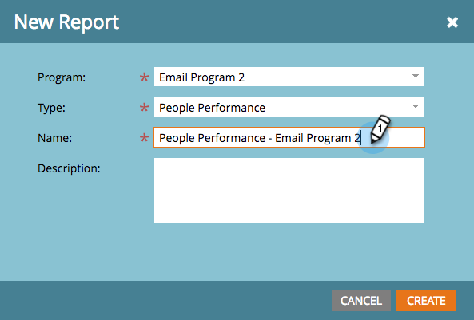

# Een rapport maken in een programma {#create-a-report-in-a-program}

Voer een rapport uit om mensen, uw programma&#39;s, bestemmingspagina&#39;s, e-mails en sociale middelen te analyseren.

1. Ga naar **Marketingactiviteiten**.
1. 

1. Selecteer een programma.

   

   >[!NOTE]
   >
   >U kunt ook rapporten maken op het tabblad **Analytics**.

   Klik met de rechtermuisknop op het programma en selecteer Nieuw lokaal element.

   

1. Klik **Rapport**.

   

1. Selecteer het rapport **Type**.

   

   >[!TIP]
   >
   >Zie [`Report Type Overview`](https://docs.marketo.com/display/DOCS/Report+Type+Overview) voor een korte beschrijving van elk.

   Geef uw rapport een naam.

   

   >[!TIP]
   >
   >Om het navigeren van uw rapporten later veel gemakkelijker te maken, omvat een verwijzing naar het rapporttype in de naam.

   Plaats het tijdkader van uw rapport. Zie [Een frame van de Tijd van het Rapport wijzigen](../../../../product-docs/reporting/basic-reporting/editing-reports/change-a-report-time-frame.md) voor meer details.

1. Klik **Rapport** tabel om uw statistieken te zien.

   

   >[!NOTE]
   >
   >**Diep duiken**
   >
   >
   >Standaard worden in rapporten alle activiteiten in uw account, voor alle programma&#39;s, beschreven. Om de vele manieren te leren u uw rapport kunt filtreren, zie [Basis het Melden](https://docs.marketo.com/display/docs/basic+reporting) diepe duik.

   >[!NOTE]
   >
   >**Herinnering**
   >
   >
   >Je kunt snel met veel rapporten eindigen. Herinner me aan [schrapping een rapport](../../../../product-docs/reporting/basic-reporting/report-activity/delete-a-report.md) u niet meer nodig hebt.

   >[!MORELIKETHIS]
   >
   >
   >
   >U kunt [een rapporttijdkader veranderen ](../../../../product-docs/reporting/basic-reporting/editing-reports/change-a-report-time-frame.md), [onderteken aan een basisrapport](../../../../product-docs/reporting/basic-reporting/report-subscriptions/subscribe-to-a-basic-report.md), [voer een rapport naar Excel](../../../../product-docs/reporting/basic-reporting/report-activity/export-a-report-to-excel.md), [filter mensen in een rapport met een slimme lijst](../../../../product-docs/reporting/basic-reporting/editing-reports/filter-people-in-a-report-with-a-smart-list.md), en [more](https://docs.marketo.com/display/docs/basic+reporting).

