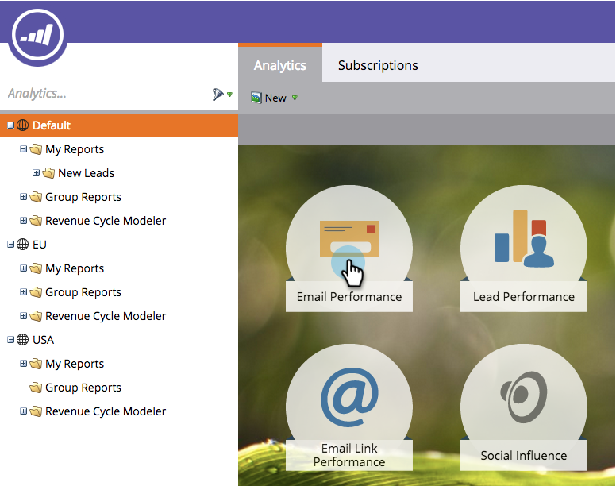

# Navigeren door de startpagina van Analytics {#navigating-the-analytics-home-page}

1. Ga naar de **Analyse** gebied.

1. 

1. Selecteer een [rapporttype](/help/marketo/product-docs/reporting/basic-reporting/report-types/report-type-overview.md).

1. 

1. Nadat u uw rapport hebt uitgevoerd, klikt u op de werkruimte om terug te gaan naar de **Analysestartpagina**.

   

   Geweldig! U weet hoe u door Analytics Home kunt navigeren!

>[!MORELIKETHIS]
>
>[Mijn rapporten en groepsrapporten begrijpen](/help/marketo/product-docs/reporting/basic-reporting/creating-reports/understanding-my-reports-and-group-reports.md)
