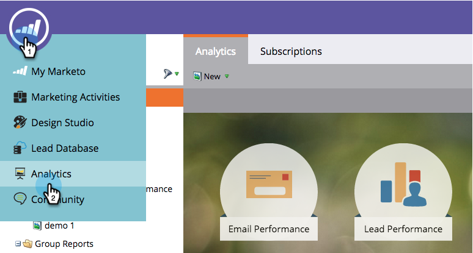

# Navigeren door de startpagina van Analytics {#navigating-the-analytics-home-page}

1. Ga naar het **[!UICONTROL Analytics]** -gebied.

   

1. Selecteer het type van a [ rapport ](/help/marketo/product-docs/reporting/basic-reporting/report-types/report-type-overview.md).

   

1. Zodra u uw rapport in werking hebt gesteld, klik op de werkruimte om terug naar het **Huis van Analytics** te gaan.

   

   Geweldig! U weet hoe u door Analytics Home kunt navigeren!

>[!MORELIKETHIS]
>
>[ Begrijpend Mijn Rapporten en de Rapporten van de Groep ](/help/marketo/product-docs/reporting/basic-reporting/creating-reports/understanding-my-reports-and-group-reports.md)
