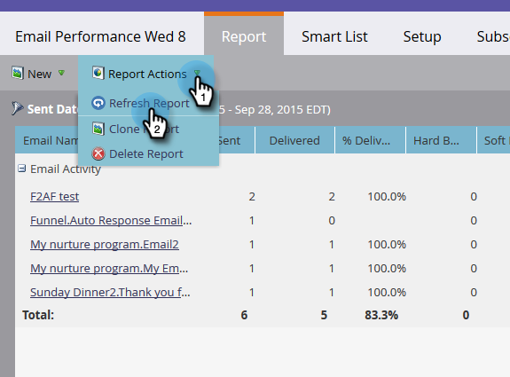

# Een rapport vernieuwen {#refresh-a-report}

Na het bekijken van een rapport, slaat Marketo het in uw gegevensbestand op zodat het snel na uw volgende het bekijken laadt. Na uw eerste mening, verfrist de rapporten automatisch om de 24 uur zodat zij altijd bijgewerkt zijn. Maar u kunt ze op elk gewenst moment handmatig vernieuwen.

1. Als u wilt zien wanneer uw rapport voor het laatst is bijgewerkt, houdt u de muisaanwijzer boven het pictogram met de cirkelvormige pijl in de linkerbenedenhoek.

   

1. Dat pictogram met een cirkelpijl is de knop Vernieuwen. Klik er gewoon op om de meest recente resultaten te verkrijgen.

   

1. U kunt het rapport ook vernieuwen door op het menu **[!UICONTROL Report Actions]** te klikken en **[!UICONTROL Refresh Report]** te selecteren.

   

   Voilà!
