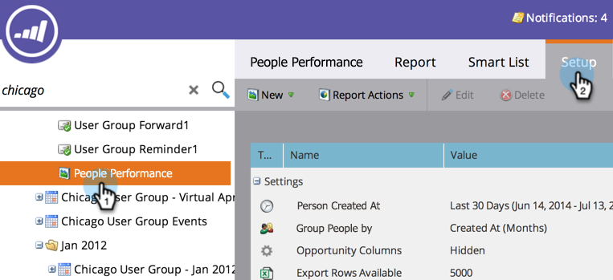

# Opportunity-kolommen toevoegen aan een lead-rapport {#add-opportunity-columns-to-a-lead-report}

Om de statistieken over kansen in uw persoonrapporten te zien, kunt u opportuniteitskolommen toevoegen.

1. Ga naar het **[!UICONTROL Marketing Activities]** -gebied.

   

1. Selecteer uw rapport in de navigatiestructuur en klik op de tab **[!UICONTROL Setup]** .

   

1. Dubbelklik op **[!UICONTROL Opportunity Columns]** .

   

1. Selecteer **[!UICONTROL Shown]** in de vervolgkeuzelijst.

   

1. Klik op het tabblad **[!UICONTROL Report]** om uw rapport weer te geven met maatstaven voor mogelijkheden.

   

   >[!TIP]
   >
   >Schuif naar rechts om meer kolommen weer te geven.

1. Om [ toe te voegen of kolommen te verwijderen uit het rapport ](/help/marketo/product-docs/reporting/basic-reporting/editing-reports/select-report-columns.md), om het even welke kolomrubriek te klikken en **[!UICONTROL Columns]** te selecteren.

   

   De beschikbare opportuniteitskolommen zijn:

   >[!NOTE]
   >
   >Elke kans wordt slechts eenmaal geteld, op basis van het primaire contact dat eraan is toegewezen.

   | Kolom | Beschrijving |
   |---|---|
   | [!UICONTROL No Opportunity] | Aantal mensen die *niet* een primaire opportuniteitscontact zijn. |
   | [!UICONTROL Days No Opportunity] | Gemiddelde leeftijd, in dagen, van mensen die *niet* een primair contact zijn. |
   | [!UICONTROL Has Opportunity] | Aantal personen dat een primaire opportuniteitcontact is. |
   | [!UICONTROL Has Opportunity %] | Percentage van de personen die een eerste opportuniteitscontact zijn. |
   | [!UICONTROL Days Until Opportunity] | Gemiddeld aantal dagen voor conversie van persoon naar primaire opportuniteitscontact. |
   | [!UICONTROL Total Opportunity Amount] | Som van alle opportuniteitsbedragen. |
   | [!UICONTROL Avg Opportunity Amount] | Som van de omvang van de kansen, gedeeld door het aantal kansen. |
   | [!UICONTROL Total Opportunity] | Aantal kansen. |
   | [!UICONTROL Closed] | Aantal kansen die zijn gesloten, gewonnen of verloren. |
   | [!UICONTROL Won] | Aantal kansen dat is gewonnen. |
   | [!UICONTROL % Won] | Percentage kansen dat is gewonnen. |
   | [!UICONTROL Total Won Amount] | Som van de bedragen van de behaalde kans. |
   | [!UICONTROL Days to Close] | Gemiddeld aantal dagen om kansen te sluiten. |
   | [!UICONTROL Days in Sales] | Gemiddelde lengte van de verkoopcyclus (dagen tot opportunity + dagen om te sluiten). |

   >[!MORELIKETHIS]
   >
   >Leer hoe te [ de grootte van uw rapport ](/help/marketo/product-docs/reporting/basic-reporting/editing-reports/configure-report-size.md) beheren.
