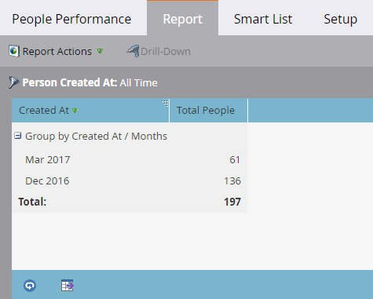

# Een rapporttijdframe wijzigen {#change-a-report-time-frame}

Wijzig de periode die door het rapport wordt bestreken, zodat u zich op een bepaald tijdstip van activiteit kunt concentreren.

1. Ga naar de **Marketingactiviteiten** (of **Analyse**).

   

1. Selecteer uw rapport in de navigatiestructuur en klik op de knop **Instellen** tab.

   

1. Dubbelklik op het veld voor het tijdframe, anders gelabeld afhankelijk van het rapporttype:

   * **Persoon gemaakt op**, in persoonlijke verslagen
   * **Verzonden datum**, in e-mailrapporten
   * **Datum van activiteit** in alle andere verslagen

   

   >[!NOTE]
   >
   >**Persoon gemaakt op** verwijst naar het moment dat de persoon in uw database bekend werd.

1. Kies het aangewezen tijdkader van het drop-down menu.

   

   >[!TIP]
   >
   >Als u specifieke datums wilt instellen, selecteert u **Aangepast** in het keuzemenu en voer de datums in het dialoogvenster **Van** en **Naar** Kalendervelden.

   Klik op de knop **Rapport** om uw rapport voor het geselecteerde tijdkader te bekijken.\
   

   >[!MORELIKETHIS]
   >
   >Om uw rapport door specifieke persoonattributen te beperken, kunt u [Personen in een rapport filteren met een slimme lijst](/help/marketo/product-docs/reporting/basic-reporting/editing-reports/filter-people-in-a-report-with-a-smart-list.md).
