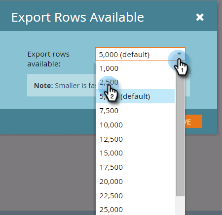

# Rapportgrootte configureren {#configure-report-size}

Standaard zijn Marketo-rapporten beperkt tot maximaal 5000 rijen, maar u kunt die limiet wijzigen.

1. Ga naar het **[!UICONTROL Marketing Activities]** -gebied.

   

1. Selecteer uw rapport in de navigatiestructuur en klik op de tab **[!UICONTROL Setup]** .

   

1. Dubbelklik op **[!UICONTROL Export Rows Available]** .

   

1. Selecteer de nieuwe limiet.

   

   >[!TIP]
   >
   >Als u de limiet wijzigt, wordt de rapportgrootte zelf gewijzigd en niet alleen het geëxporteerde [!DNL Excel] -bestand. Als uw rapport te lang duurt om te genereren, verlaagt u de limiet!

1. Klik op **[!UICONTROL Save]** om de nieuwe limiet te bevestigen.

   

   Je bent klaar! Het verslag zal zich aan de nieuwe limiet houden.

   >[!MORELIKETHIS]
   >
   >U kunt [ uw rapport ](/help/marketo/product-docs/reporting/basic-reporting/report-activity/export-a-report-to-excel.md) met de nieuwe grens uitvoeren.
