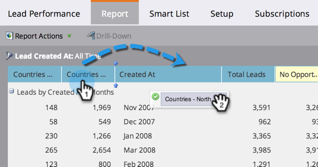
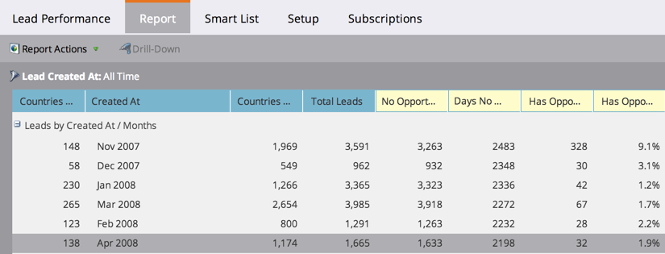

# Rapportkolommen opnieuw ordenen {#reorder-report-columns}

U kunt de volgorde van de kolommen in een rapport wijzigen.

1. Ga naar het **[!UICONTROL Marketing Activities]** (of **[!UICONTROL Analytics]** ) gebied.

   

1. Selecteer het rapport in de navigatiestructuur en klik op de tab **[!UICONTROL Report]** .

   

1. Klik op de kolom en houd deze ingedrukt om deze naar de nieuwe positie te slepen en laat vervolgens de muisknop los.

   

1. Dat is het! De kolommen worden nu in de nieuwe volgorde weergegeven.

   

   U kunt deze stappen herhalen tot de kolommen in de voor u beste volgorde worden weergegeven.

   >[!MORELIKETHIS]
   >
   >[ Uitgezochte Kolommen van het Rapport ](/help/marketo/product-docs/reporting/basic-reporting/editing-reports/select-report-columns.md)
