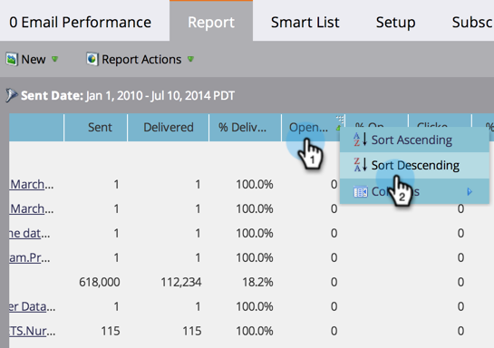

# Rapport sorteren op kolommen {#sort-report-on-columns}

Met kolommen kunt u de gegevens in uw rapport sorteren en de belangrijkste figuren gemakkelijk vinden.

1. Ga naar **[!UICONTROL Analytics]** (of **[!UICONTROL Marketing Activities]** ).

   

1. Selecteer het rapport in de navigatiestructuur en klik op de tab **[!UICONTROL Report]** .

   

1. Klik op de belangrijkste kolom en selecteer een sorteervolgorde.

   

1. Geweldig! Nu kunt u zich op de interessantste gegevens in uw rapport concentreren.

   

   >[!MORELIKETHIS]
   >
   >[&#x200B; Uitgezochte Kolommen van het Rapport &#x200B;](/help/marketo/product-docs/reporting/basic-reporting/editing-reports/select-report-columns.md)
