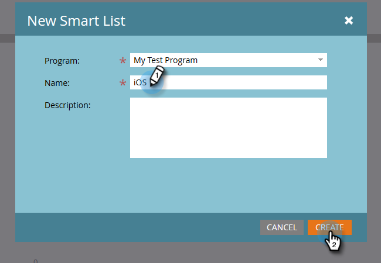

# Bouw een Rapport van de Prestaties van Mensen met Mobiele Kolommen van het Platform {#build-a-people-performance-report-with-mobile-platform-columns}

Ga als volgt te werk om een People Performance Report met kolommen voor mobiele platforms (iOS/Android) te maken.

## Mobiele slimme lijsten maken {#create-mobile-smart-lists}

1. Ga naar **[!UICONTROL Marketing Activities]** .

   

1. Kies een programma.

   

1. Selecteer onder **[!UICONTROL New]** de optie **[!UICONTROL New Local Asset]** .

   

1. Klik op **[!UICONTROL Smart List]**.

   

1. Typ een naam en klik op **[!UICONTROL Create]** .

   

1. Zoek en sleep het filter [!UICONTROL Opened Email] naar het canvas.

   

1. E-mail instellen op **[!UICONTROL is any]** .

   

1. Klik op **[!UICONTROL Add Constraint]** en selecteer **[!UICONTROL Platform]** .

   

   >[!TIP]
   >
   >In dit voorbeeld hebben we het filter [!UICONTROL Opened Email] gebruikt. U kunt het filter [!UICONTROL Clicked Email] ook gebruiken aangezien het de beperking van het Platform heeft.

1. Stel [!UICONTROL Platform] in op **[!UICONTROL iOS]** .

   

   >[!NOTE]
   >
   >Ten minste één persoon moet een e-mailbericht hebben geopend op een iOS-apparaat, anders kan Marketo dit niet vinden. Als dit niet het geval is, kunt u het handmatig invoeren en opslaan.

   Maak nu een tweede slimme lijst voor het Android-platform. Ga vervolgens naar de volgende sectie.

## Een prestatierapport voor mensen maken {#create-a-people-performance-report}

1. Selecteer onder Marketingactiviteiten het programma waarin uw **[!UICONTROL iOS]** - en **[!UICONTROL Android]** slimme lijsten zijn opgeslagen.

   

1. Selecteer onder **[!UICONTROL New]** de optie **[!UICONTROL New Local Asset]** .

   

1. Klik op **[!UICONTROL Report]**.

   

1. Stel Type in op **[!UICONTROL People Performance]** .

   

1. Klik op **[!UICONTROL Create]**.

   

   Je doet het geweldig! Nu over naar de volgende sectie.

## Mobiele slimme lijsten toevoegen als kolommen {#add-mobile-smart-lists-as-columns}

1. Klik in het rapport dat u zojuist hebt gemaakt op **[!UICONTROL Setup]** en sleep **[!UICONTROL Custom Columns]** naar het canvas.

   

   >[!NOTE]
   >
   >Standaard wordt in het People Performance Report gekeken naar de laatste 7 dagen. U kunt de tijdlijn wijzigen door erop te dubbelklikken.

1. Zoek en selecteer de slimme lijsten die u eerder hebt gemaakt en klik op **[!UICONTROL Apply]** .

   

1. Klik op **[!UICONTROL Report]** om het rapport uit te voeren en de gegevens weer te geven.

   

   Mooi cool, toch? Echt waar!
