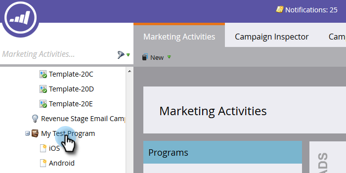

# Bouw een Rapport van de Prestaties van Mensen met Mobiele Kolommen van het Platform {#build-a-people-performance-report-with-mobile-platform-columns}

Ga als volgt te werk om een People Performance Report met kolommen voor mobiele platforms (iOS/Android) te maken.

## Mobiele slimme lijsten maken {#create-mobile-smart-lists}

1. Ga naar **Marketingactiviteiten**.

   

1. Kies een programma.

   

1. Onder **Nieuw**, selecteert u **Nieuw lokaal element**.

   

1. Klikken **Slimme lijst**.

   

1. Typ een naam en klik op **Maken**.

   

1. Zoek en sleep het filter Geopende e-mail naar het canvas.

   

1. E-mail instellen op **is**.

   

1. Klikken op **Restrictie toevoegen** en selecteert u **Platform**.

   

   >[!TIP]
   >
   >In dit voorbeeld hebben we het filter Geopende e-mail gebruikt. U kunt ook het geklikte filter E-mail gebruiken aangezien het de Platform beperking heeft.

1. Platform instellen op **iOS**.

   

   >[!NOTE]
   >
   >Ten minste één persoon moet een e-mailbericht hebben geopend op een iOS-apparaat, anders kan Marketo dit niet vinden. Als dit niet het geval is, kunt u het handmatig invoeren en opslaan.

   Maak nu een tweede slimme lijst voor het Android-platform. Ga vervolgens naar de volgende sectie.

## Een prestatierapport voor mensen maken {#create-a-people-performance-report}

1. Selecteer onder Marketingactiviteiten het programma waarin uw **iOS** en **Android** slimme lijsten.

   

1. Onder **Nieuw**, selecteert u **Nieuw lokaal element**.

   

1. Klikken **Rapport**.

   

1. Type instellen op **Prestaties van mensen**.

   

1. Klikken **Maken**.

   

   Je doet het geweldig! Nu over naar de volgende sectie.

## Mobiele slimme lijsten toevoegen als kolommen {#add-mobile-smart-lists-as-columns}

1. Klik in het rapport dat u zojuist hebt gemaakt op **Instellen** en sleep vervolgens **Aangepaste kolommen** op het canvas.

   

   >[!NOTE]
   >
   >Standaard wordt in het People Performance Report gekeken naar de laatste 7 dagen. U kunt de tijdlijn wijzigen door erop te dubbelklikken.

1. Zoek en selecteer de slimme lijsten die u eerder hebt gemaakt en klik op **Toepassen**.

   

1. Klikken **Rapport** om het rapport uit te voeren en uw gegevens te zien.

   

   Mooi cool, toch? Echt waar!
