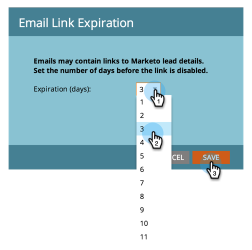

# Verander de Vervaltijd voor URLS in de E-mail van het Rapport {#change-the-expiration-time-for-urls-in-report-emails}

>[!NOTE]
>
>**Vereiste Bevoegdheden Admin**

Koppelingen in je e-mailberichten met je abonnement op rapporten verlopen na drie dagen. Voer de volgende stappen uit om de vervaltijd voor deze koppelingen te wijzigen.

1. Klik onder **[!UICONTROL Admin]** op **[!UICONTROL Login Settings]** .

   

1. Klik op de knop **[!UICONTROL Edit URL Expiration]** .

   

1. Selecteer in het keuzemenu hoeveel dagen voordat de koppeling verloopt. Klik op **[!UICONTROL Save]** .

   

   Koel, u hebt uw montages uitgegeven van de e-mailverbinding vervaldatum.

   >[!NOTE]
   >
   >Deze zijn alleen van toepassing op koppelingen in rapporten en waarschuwingen, niet op marketingberichten.
