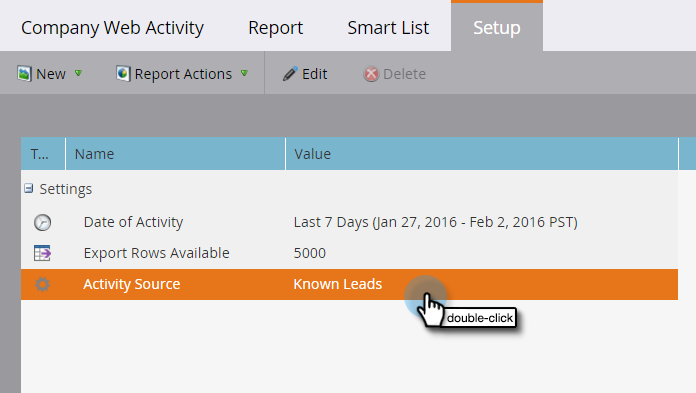

# Personen of anonieme bezoekers weergeven in webrapporten {#display-people-or-anonymous-visitors-in-web-reports}

>[!PREREQUISITES]
>
>[ voeg Munchkin het Volgen Code aan Uw Website toe ](/help/marketo/product-docs/administration/additional-integrations/add-munchkin-tracking-code-to-your-website.md)

In [[!UICONTROL Web Page Activity]](/help/marketo/product-docs/reporting/basic-reporting/report-types/web-page-activity-report.md) en [[!UICONTROL Company Web Activity] rapporten ](/help/marketo/product-docs/reporting/basic-reporting/report-types/company-web-activity-report.md) kunt u of [ mensen of anonieme bezoekers ](/help/marketo/product-docs/core-marketo-concepts/smart-lists-and-static-lists/managing-people-in-smart-lists/understanding-anonymous-activity-and-people.md) zien die uw plaats bezoeken. De anonieme bezoekers hebben gegevens verzameld, zoals Metro Area.  Hier is hoe te om te selecteren of het rapport bekende lood of anonieme bezoekers toont.

1. Klik in uw [!UICONTROL Web Page Activity] -rapport op **[!UICONTROL Setup]** .

   

1. Dubbelklik op **[!UICONTROL Activity Source]** .

   

1. In popup, uitgezochte **[!UICONTROL Known Leads]** (mensen) of **Anonieme Bezoekers** van drop-down.

   

   >[!NOTE]
   >
   >Het opnemen van ISP&#39;s voor anonieme bezoekers genereert een langer rapport, maar het uitsluiten ervan geeft een duidelijker beeld van waar uw bezoekers vandaan komen, naast de standaardbronnen, zoals Google.

1. Dat is het. Klik op de tab **[!UICONTROL Report]** om terug te gaan en uw rapport met bekende of anonieme personen weer te geven.

   

>[!MORELIKETHIS]
>
>[ het Volgen Anonieme Activiteit en Mensen ](/help/marketo/product-docs/reporting/basic-reporting/report-activity/tracking-anonymous-activity-and-people.md)
