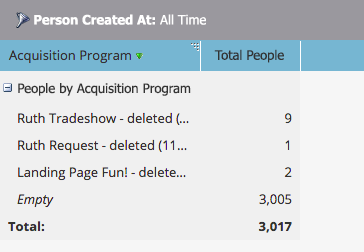

# Omlaag boven in een rapport over de prestaties van het volk {#drill-down-in-a-people-performance-report}

Bor neer in een Rapport van de Prestaties van Mensen om extra persooninformatie te zien.

1. Klik op de tab **[!UICONTROL Report]** om een bestaand rapport weer te geven.

   

1. Selecteer een rij in het rapport waarover u meer wilt weten.

   

1. Klik op **[!UICONTROL Drill-Down]** .

   

1. Selecteer in het pop-upvenster **[!UICONTROL Drill-Down]** het kenmerk waarnaar u wilt dieper gaan. Klik vervolgens op **[!UICONTROL Drill-Down]** .

   

1. Geweldig werk! Het boor-down rapport zal in een nieuw lusje openen. Nu kun je het nieuwe rapport verkennen.

   >[!TIP]
   >
   >Als u geen nieuw open rapportlusje ziet, zou uw browser pop-ups kunnen blokkeren. Wijzig de browserinstellingen om dit toe te staan.

   

1. Als u de resultaten wilt opslaan (optioneel), klikt u op het pictogram **[!UICONTROL Export]** linksonder.

   
