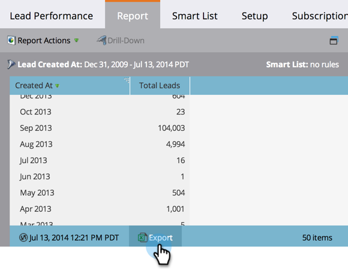

# Een rapport exporteren naar Excel {#export-a-report-to-excel}

U kunt om het even welk rapport naar een dossier van Excel uitvoeren, om met de gegevens in andere software te werken.

1. Ga naar het gebied **Marketingactiviteiten** .

   

1. Selecteer uw rapport in de navigatiestructuur en klik op het tabblad **Rapport** .

   

1. Klik op de knop **Exporteren** .

   

   Dat is alles! Uw browser vraagt u om het dossier van Excel aan uw systeem op te slaan.

   >[!NOTE]
   >
   >**Verwante artikelen**
   >
   >
   >Als het gedownloade bestand te groot is, kunt u de rapportgrootte  wijzigen.

   >[!NOTE]
   >
   >**Diep duiken**
   >
   >
   >Zie alle andere nuttige dingen u met rapporten in de [Basis meldt](http://docs.marketo.com/display/docs/basic+reporting) diep duik kunt doen.

