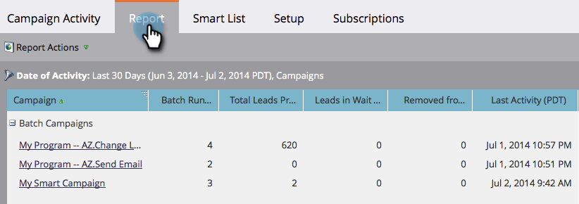

# Een campagneactiviteitenrapport filteren {#filter-a-campaign-activity-report}

Focus uw [Rapport Campagneactiviteit](/help/marketo/product-docs/reporting/basic-reporting/report-types/campaign-activity-report.md)op specifieke [slimme campagnes](/help/marketo/product-docs/core-marketo-concepts/smart-campaigns/creating-a-smart-campaign/understanding-batch-and-trigger-smart-campaigns.md).

1. Ga naar **Marketingactiviteiten** (of **Analytics**) en selecteer uw rapport van de campagneactiviteit.

   

1. Klik op het tabblad **Setup** en dubbelklik op **Campagnes**.

   

1. Kies de mappen en specifieke slimme campagnes die u in uw rapport wilt opnemen. Klik **Toepassen**.

   

   >[!TIP]
   >
   >Als u een map selecteert, bevat uw rapport alles wat de map bevat op het moment dat het rapport wordt uitgevoerd.

1. Je bent klaar! Klik **Rapport** tabel om _just_ de geselecteerde slimme campagnes in uw rapport te zien.

   

>[!MORELIKETHIS]
>
>[Rapport over e-mailprestaties voor campagne](/help/marketo/product-docs/reporting/basic-reporting/report-types/campaign-email-performance-report.md)
