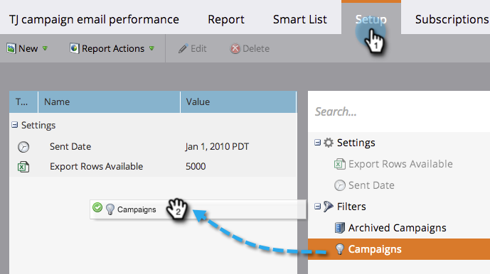

# Middelen in een campagne-e-mailrapporten filteren {#filter-assets-in-a-campaign-email-reports}

Focus uw rapport [Campagne-e-mailprestaties](../../../../product-docs/reporting/basic-reporting/report-types/campaign-email-performance-report.md) op specifieke [slimme campagnes](http://docs.marketo.com/display/docs/smart+campaigns) in uw programma&#39;s (&#39;lokale middelen&#39;) of op de gearchiveerde campagnes.

1. Ga naar **Analytics **(of **Marketing Activity**) gebied.

   

1. Selecteer uw e-mailprestatierapport.

   

1. Klik op het tabblad **Setup** en sleep over een filter.

   

   * **Campagnes**: Actieve slimme campagnes in uw Marketo-account.
   * **Gearchiveerde campagnes**: Inactieve, gepensioneerde slimme campagnes.

1. Kies de mappen en specifieke slimme campagnes die u in uw rapport wilt opnemen.

   

   >[!TIP]
   >
   >Als u een map selecteert, bevat uw rapport alles wat de map bevat op het moment dat het rapport wordt uitgevoerd.

1. Je bent klaar! Klik op het tabblad **Rapport** om uw gefilterde rapport weer te geven.

   

   >[!NOTE]
   >
   >**Verwante artikelen**
   >
   >    
   >    
   >    * [Rapport over e-mailprestaties voor campagne](../../../../product-docs/reporting/basic-reporting/report-types/campaign-email-performance-report.md)
   >    * [Middelen in een e-mailrapport filteren](filter-assets-in-an-email-report.md)

   >[!NOTE]
   >
   >**Diep duiken**
   >
   >
   >Meer informatie over rapporten vindt u in [Basic Reporting](http://docs.marketo.com/display/docs/basic+reporting).

