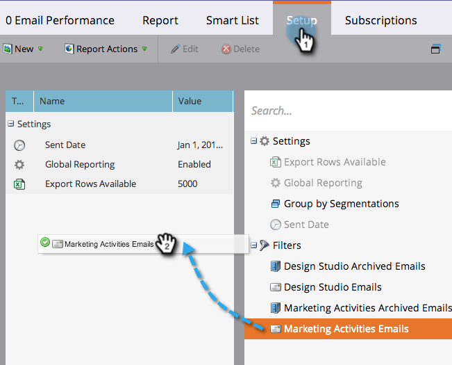

# Middelen in een e-mailrapport filteren {#filter-assets-in-an-email-report}

Focus op uw [E-mailprestaties](/help/marketo/product-docs/email-marketing/email-programs/email-program-data/email-performance-report.md) of [Prestaties van e-mailkoppelingen](/help/marketo/product-docs/email-marketing/email-programs/email-program-data/email-link-performance-report.md) e-mailberichten in uw programma&#39;s (&#39;lokale middelen&#39;), in Design Studio (&#39;globale activa&#39;) of in de programma&#39;s die zijn gearchiveerd.

1. Ga naar **Analyse** (of **Marketingactiviteiten**).

   

1. Selecteer uw e-mailrapport.

   

1. Klik op de knop **Instellen** en sleep over een filter.

   

   * **Design Studio-e-mails**: Globale activa, die in de Studio van het Ontwerp worden beheerd.
   * **E-mails over marketingactiviteiten**: Lokale elementen in programma&#39;s op het tabblad Marketingactiviteiten.
   * **Gearchiveerde e-mails**: Inactieve e-mails met pensioen.

1. Kies de mappen en specifieke e-mails die u in uw rapport wilt opnemen.

   

   >[!TIP]
   >
   >Als u een map selecteert, bevat uw rapport alles wat de map bevat op het moment dat het rapport wordt uitgevoerd.

1. Je bent klaar! Klik op de knop **Rapport** om uw gefilterde rapport te bekijken.

   

>[!MORELIKETHIS]
>
>[Middelen in een campagne-e-mailrapporten filteren](/help/marketo/product-docs/reporting/basic-reporting/report-activity/filter-assets-in-a-campaign-email-reports.md)
