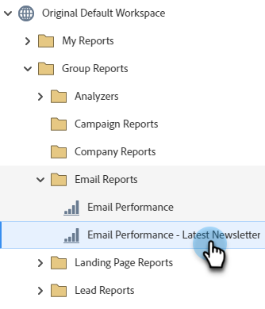

# Verwijderde/samengevoegde records filteren in een e-mailprestatierapport {#filter-deleted-merged-records-in-an-email-performance-report}

Focus uw e-mailprestatierapport op e-mailberichten in uw programma&#39;s (&#39;lokale middelen&#39;), op de e-mailberichten in Design Studio (&#39;globale middelen&#39;) of op de gearchiveerde e-mailberichten.

>[!NOTE]
>
>Het filteren van elementen in rapporten wordt niet ondersteund in de Satellietmodus (het pictogram &#39;Open in a new window&#39; rechts van de elementdetailpagina).

1. Ga naar het **gebied van Analytics** (of van de Marketing Activiteiten).

   

1. Selecteer uw e-mailprestatierapport.

   

1. Klik het **lusje van de Opstelling** en selecteer **Gewiste/Samengevoegde Mensen van de Huid**.

   

1. Klik drop-down, uitgezochte **Toegelaten**, en klik **sparen**.

   

Je bent klaar! Klik op het tabblad Rapport om uw gefilterde rapport weer te geven.
