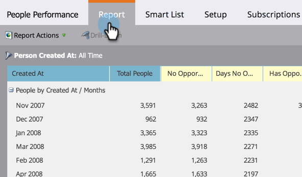

# Personen groeperen op basis van kenmerk {#group-person-reports-by-attribute}

U kunt uw persoonrapporten door om het even welke persoon of bedrijfattributen groeperen.

1. Ga naar het **[!UICONTROL Marketing Activities]** (of **[!UICONTROL Analytics]** ) gebied.

   

1. Selecteer het persoonlijke rapport in de navigatiestructuur en klik op de tab **[!UICONTROL Setup]** .

   

1. Dubbelklik op **[!UICONTROL Group People by]** .

   

   >[!NOTE]
   >
   >U kunt ook [ uw persoonrapporten groeperen door segment ](/help/marketo/product-docs/personalization/segmentation-and-snippets/segmentation/group-person-reports-by-segment.md).

   Selecteer in het dialoogvenster [!UICONTROL Group People by] de persoon of het bedrijfskenmerk dat u wilt gebruiken voor groeperen.

   

   >[!TIP]
   >
   >Als u een kenmerk met een numerieke waarde kiest, zoals _[!UICONTROL Created At]_&#x200B;of&#x200B;_[!UICONTROL Annual Revenue]_ , selecteert u de metriek in de vervolgkeuzelijst **[!UICONTROL Units]** aan de rechterkant.

   Dat is het! Klik op de tab **[!UICONTROL Report]** om het rapport dienovereenkomstig te groeperen.

   

   >[!MORELIKETHIS]
   >
   >[ voeg de Kolommen van de Douane aan een Rapport van de Persoon toe ](/help/marketo/product-docs/reporting/basic-reporting/editing-reports/add-custom-columns-to-a-person-report.md)
