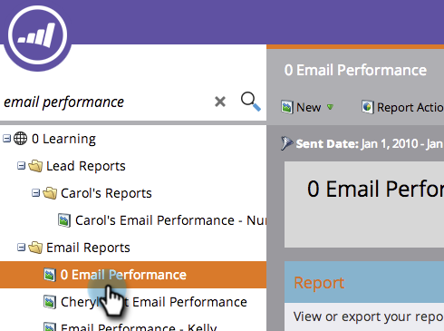

# E-mail rapporteren, campagneprestaties in alle werkruimten {#report-email-campaign-performance-across-workspaces}

Zet Globale Rapportering aan om gegevens van al uw Marketo [ werkruimten ](/help/marketo/product-docs/administration/workspaces-and-person-partitions/create-a-new-workspace.md) in uw [ E-mailPrestaties ](/help/marketo/product-docs/email-marketing/email-programs/email-program-data/email-performance-report.md) en [ E-mailprestaties van de Verbinding ](/help/marketo/product-docs/email-marketing/email-programs/email-program-data/email-link-performance-report.md) rapporten te omvatten.

1. Ga naar **[!UICONTROL Analytics]** (of **[!UICONTROL Marketing Activities]** ) gebied.

   

1. Selecteer uw rapport.

   

1. Klik op de tab **[!UICONTROL Setup]** en dubbelklik **[!UICONTROL Global Reporting]** .

   

1. Selecteer **[!UICONTROL Enabled]** .

   

1. Dat is alles! Klik op het tabblad **[!UICONTROL Report]** om de gegevens in al uw werkruimten weer te geven.

   

   >[!MORELIKETHIS]
   >
   >[ filter Assets in een E-mailrapport ](/help/marketo/product-docs/reporting/basic-reporting/report-activity/filter-assets-in-an-email-report.md)
