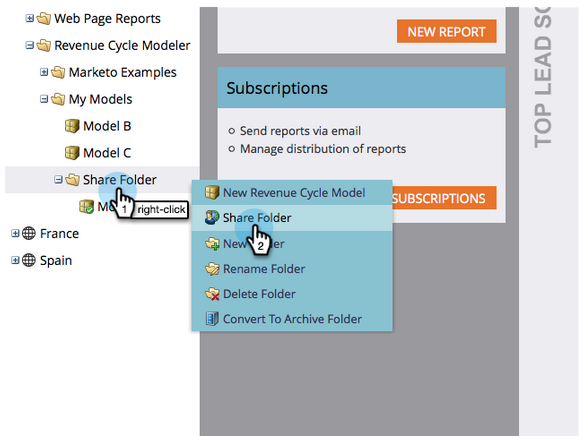

# Een model delen over werkruimten {#share-a-model-across-workspaces}

Marketo biedt u de mogelijkheid om een model of modellen te delen met verschillende werkruimten. Zo gaat het.

>[!NOTE]
>
>**FYI**
>
>Marketo is nu bezig met het standaardiseren van de taal voor alle abonnementen, dus u ziet mogelijk leads/leads in uw abonnement en personen/personen in docs.marketo.com. Deze termen betekenen hetzelfde. het heeft geen invloed op de instructies van het artikel . Er zijn nog enkele andere veranderingen. [Meer](http://docs.marketo.com/display/DOCS/Updates+to+Marketo+Terminology)informatie.

1. Ga naar de sectie **Analytics** .

   

1. Klik met de rechtermuisknop op de map **Mijn modellen** en klik op **Nieuwe map**.

   

1. Geef de map een naam.

   

1. Sleep de modellen die u wilt delen naar de **Share-map**.

   

1. Klik met de rechtermuisknop op uw map en klik op Map **** delen.

   

   >[!NOTE]
   >
   >
   >Als u een model deelt met een andere werkruimte, kunnen die gebruikers rapporten uitvoeren op basis van het model.

1. Selecteer de werkruimten waarmee u de map wilt delen en klik op **Opslaan**.

   

Zo eenvoudig is het! Mensen uit andere werkruimten kunnen nu door het gedeelde model navigeren. U kunt persoonlijke toewijzing in die werkruimte willen uitvoeren, zie het [Starten van Uw Model](https://community.marketo.com/MarketoArticle?id=kA050000000KyvQCAS) van de Uitwisseling van Inkomsten voor details.
