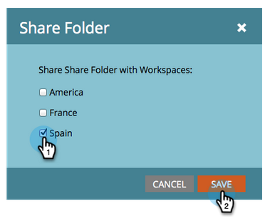

# Een model delen over werkruimten {#share-a-model-across-workspaces}

Met Marketo kunt u een model of modellen delen met verschillende werkruimten. Zo gaat het.

1. Ga naar de sectie **[!UICONTROL Analytics]** .

   

1. Klik met de rechtermuisknop op de map **[!UICONTROL My Models]** en klik op **[!UICONTROL New Folder]** .

   

1. Geef de map een naam.

   

1. Sleep de modellen die u in de **[!UICONTROL Share Folder]** wilt delen.

   

1. Klik met de rechtermuisknop op de map en klik op **[!UICONTROL Share Folder]** .

   

   >[!NOTE]
   >
   >Als u een model deelt met een andere werkruimte, kunnen die gebruikers rapporten uitvoeren op basis van het model.

1. Selecteer de werkruimten waarmee u de map wilt delen en klik op **[!UICONTROL Save]** .

   

Zo eenvoudig is het! Mensen uit andere werkruimten kunnen nu door het gedeelde model navigeren.
