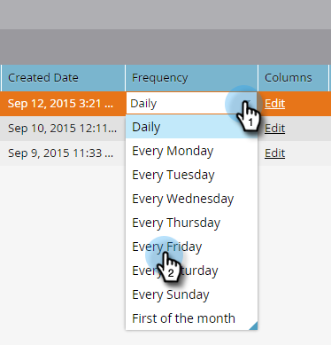

# Een abonnement op een slimme lijst bewerken {#edit-a-smart-list-subscription}

U kunt deze kolommen rechtstreeks bewerken op het tabblad Abonnementen, dat wordt weergegeven in Marketingactiviteiten of Database:

* Ontvangers
* Frequentie
* Kolommen
* Aflevering beëindigen
* Indeling

1. Selecteer **Database** (wij gebruiken het in dit voorbeeld, maar de Activiteiten van de Marketing werken precies het zelfde).

   

1. Selecteer het abonnement dat u wilt bewerken.

   

1. Klik in de kolom Ontvangers en het wordt geopend zodat u meer e-mailadressen kunt invoeren (scheidt hen met een komma).

   

1. Klik op de kolom **Frequentie** om uw instelling te kiezen of te wijzigen.

   

1. Open de kolom **Kolommen** en gebruik de kiezer om kolommen toe te voegen of te verwijderen uit het rapport. De Kolommen van het rapport bevatten alle beschikbare kolommen en de Kolommen van het Markeren toont slechts die u aan vertoning in uw rapport hebt geselecteerd. Klik **Opslaan**.

   

   >[!NOTE]
   >
   >De kolommen onder de Kolommen van het Marketo zijn de rapportkolommen, niet degenen die in het het rapportlusje van Abonnementen worden gebruikt.

1. Klik op de kolom **Einddatum** om de einddatum te bewerken. Selecteer **Nooit** of **Datum**. Voer de datum in of kies een datum in de kalender. Klik **Goedkeuren**.

   

1. Het laatste stukje van de puzzel is de indeling. Klik op de kolom **Indeling** en selecteer de gewenste kolom. CSV is de standaardwaarde.

   
