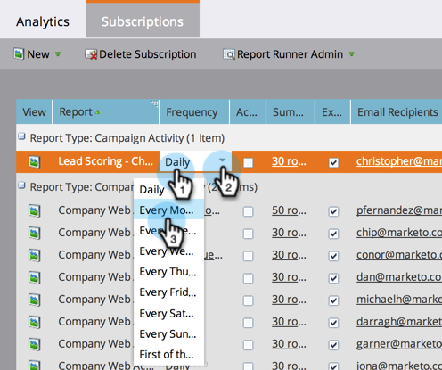

# Rapportabonnementen beheren {#manage-report-subscriptions}

Configureer en verwijder rapportabonnementen.

1. Ga naar de **Analyse** gebied.

   

1. Klik op de knop **Abonnementen** tab.

   

   Op deze pagina worden de abonnementen op alle rapporten in uw account weergegeven, gegroepeerd op [rapporttype](/help/marketo/product-docs/reporting/basic-reporting/report-types/report-type-overview.md). Dit omvat [abonnementen op basisrapporten](/help/marketo/product-docs/reporting/basic-reporting/report-subscriptions/subscribe-to-a-basic-report.md) en aan de rapporten van de Ontdekkingsreiziger van de Ontdekkingsreiziger van de Opbrengst.

   >[!TIP]
   >
   >U kunt ook abonnementen op een afzonderlijk rapport beheren in **Marketingactiviteiten**. Selecteer het rapport en klik op de knop **Abonnementen** tab.

   Als u wilt instellen hoe vaak een rapport per e-mail wordt verzonden, klikt u op het veld Frequentie en selecteert u een nieuwe optie in het keuzemenu.

   

1. Als u de e-mailadressen in een abonnement wilt wijzigen, klikt u op de knop **E-mailontvangers** en bewerk de e-mailadressen.

   

   >[!TIP]
   >
   >* Gebruik komma&#39;s tussen e-mailadressen.
   >* Als u uw bewerkingen wilt opslaan, klikt u in een gebied _buiten_ de abonnementenlijst.

   U kunt ook:

   * Klik op de knop **Weergave** om een rapport te openen.
   * Schakel de optie **Actief** Schakel het selectievakje in om het abonnement te deactiveren.
   * Klik en bewerk de **Samenvatting** om te wijzigen hoeveel voorvertoningsrijen er in de e-mail worden weergegeven.
   * Schakel de optie **Excel** Schakel het selectievakje in om rapportoverzichten zonder de spreadsheetbijlage te verzenden.
   * Klik op de knop **Verzenden** om het rapport direct te verzenden.

1. Als u een abonnement wilt verwijderen, selecteert u de rij en klikt u op **Abonnement verwijderen**.

   

1. Bevestig dat u het abonnement wilt verwijderen.

   

   >[!MORELIKETHIS]
   >
   >* [Abonneren op een basisrapport](/help/marketo/product-docs/reporting/basic-reporting/report-subscriptions/subscribe-to-a-basic-report.md)
   >* [Abonneren op een rapport van de Ontdekkingsreiziger van de Inkomsten](/help/marketo/product-docs/reporting/revenue-cycle-analytics/revenue-explorer/subscribe-to-a-revenue-explorer-report.md)

