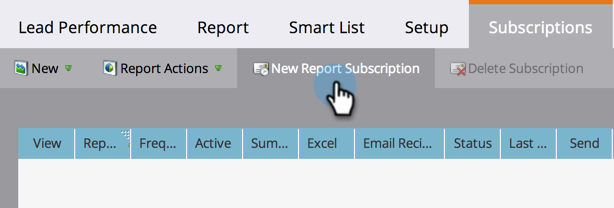

# Abonneren op een basisrapport {#subscribe-to-a-basic-report}

Als u automatische updates van een basisrapport wilt ontvangen of deze wilt delen, kunt u elk e-mailadres op een bestaand rapport abonneren.

>[!NOTE]
>
>Voor het rapportabonnementen van de Ontdekkingsreiziger van de Ontdekkingsreiziger van de Opbrengst, zie [ aan een Rapport van de Ontdekkingsreiziger van de Opbrengst ](/help/marketo/product-docs/reporting/revenue-cycle-analytics/revenue-explorer/subscribe-to-a-revenue-explorer-report.md) intekenen.

1. Ga naar het **[!UICONTROL Marketing Activities]** -gebied.

   

1. Selecteer uw rapport in de navigatiestructuur en klik op de tab **[!UICONTROL Subscriptions]** .

   

   >[!NOTE]
   >
   >U kunt zich ook abonneren op rapporten via het tabblad **[!UICONTROL Analytics]** .

1. Klik op **[!UICONTROL New Report Subscription]**.

   

1. Voer het e-mailadres of de e-mailadressen in en stel de frequentie van de e-mails in.

   

   >[!NOTE]
   >
   >Iedereen kan zich afmelden voor het rapport in de e-mail die hij ontvangt.

   Dat is het! Controleer uw postvak IN!

   

   >[!MORELIKETHIS]
   >
   >Leer hoe te [ om al uw rapportabonnementen ](/help/marketo/product-docs/reporting/basic-reporting/report-subscriptions/manage-report-subscriptions.md) op één plaats te beheren.
