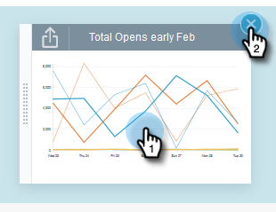

# E-mailinzichten, snelle grafieken {#email-insights-quick-charts}

Snelle grafieken zijn miniaturen die u kunt aanpassen en opslaan, zodat u snel kunt zien welke diagrammen u het meest gebruikt.

## Een nieuwe snelle grafiek maken {#create-a-new-quick-chart}

In dit voorbeeld kiezen we voor de eerste drie weken van februari 2016, in de staten Californië en Florida.

1. Klik op het datumfilter rechts van het [!UICONTROL Analytics] -scherm.

   

1. Kies het gewenste datumbereik.

   

1. Klik op **[!UICONTROL Apply]** als het datumbereik is geselecteerd.

   

1. Het diagram verandert nadat uw datums zijn toegepast.

   

1. Klik op de eerste vervolgkeuzelijst. Klik om uw criteria te selecteren (als deze nog niet is geselecteerd) en deselecteer ongewenste criteria.

   

1. Klik rechts van het diagram op het exportpictogram en selecteer **[!UICONTROL Save as Quick Chart]** .

   

1. Geef een naam op voor het Snelle diagram en klik op **[!UICONTROL Save]** .

   

   >[!NOTE]
   >
   >U kunt maximaal 20 snelle grafieken gebruiken. Ze kunnen worden verwijderd en vervangen.

1. Uw nieuwe Snelle Grafiek zal met anderen verschijnen.

   

   En dat is het!

   >[!TIP]
   >
   >U verplaatst een snel diagram door erop te klikken en het naar de gewenste positie te slepen.

## Een snelle grafiek verwijderen {#delete-a-quick-chart}

Wilt u een van uw snelle grafieken verwijderen? Het is gemakkelijk!

1. Klik op het pictogram **[!UICONTROL Quick Charts]** .

   

1. Houd de cursor boven het gewenste diagram, maar klik er niet op. Bij het aanwijzen wordt een X weergegeven. Klik **X**.

   

1. Klik op **[!UICONTROL Ok]**.

   

   Uw snelle diagram wordt nu verwijderd. Ik vertelde je dat het makkelijk was.
