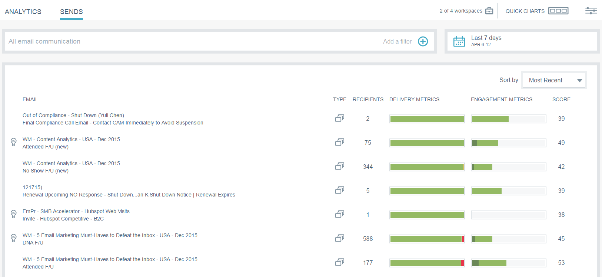

# E-mailinzichten verzenden overzicht {#email-insights-sends-overview}

Controleer op de pagina [!UICONTROL Sends] de kenmerken van recente e-mailcommunicatie.

Gebruik [ het filtreren ](/help/marketo/product-docs/reporting/email-insights/filtering-in-email-insights.md) om te specificeren welke e-mails u wilt zien.

Rechts op de pagina vind je verschillende informatie over je verzonden e-mails.

**[!UICONTROL Type]** geeft het type element aan dat wordt gebruikt.
**[!UICONTROL Recipient]** -nummer is het aantal personen dat de e-mail heeft ontvangen.
In **[!UICONTROL Delivery Metrics]** kunt u snel zien hoeveel e-mails zijn bezorgd, in behandeling zijn of zijn teruggestuurd.
In **[!UICONTROL Engagement Metrics]** kunt u snel zien hoeveel ontvangers een e-mail hebben geopend, erop hebben geklikt en het abonnement hebben opgezegd.
**[!UICONTROL Score]** is de Score van de Betrokkenheid van uw e-mail .

Uw e-mails worden standaard gesorteerd op de meest recente, maar u kunt ze sorteren op elke beschikbare metrische waarde.

>[!NOTE]
>
>E-mailberichten worden weergegeven op basis van de naam van het programma of de campagne (boven) en de naam van het e-mailmiddel (onder).

Als u de status van uw e-mailbericht wilt weergeven in Analytics, plaatst u de muis naast Score en klikt u op het diagrampictogram.

Koel spul!

>[!MORELIKETHIS]
>
>[ E-mail het Overzicht van Analytics van Inzichten ](/help/marketo/product-docs/reporting/email-insights/email-insights-analytics-overview.md)
