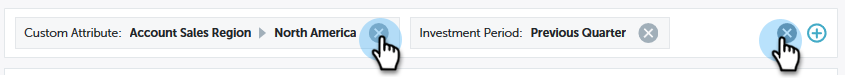

# Filteren in [!UICONTROL Performance Insights] {#filtering-in-performance-insights}

U kunt eenvoudig gegevens filteren om specifieke informatie op te vragen.

Klik op + om filters toe te voegen.

>[!NOTE]
>
>Op dit moment zijn Aangepaste kenmerken alleen beschikbaar in filters voor klanten die de functie Analyse van de inkomstencyclus hebben ingeschakeld.

Als u op een categorie klikt, worden meerdere subcategorieën weergegeven.

Kies een subcategorie en zoek/selecteer een waarde.

De grafieken worden bijgewerkt om de geselecteerde filter(s) te weerspiegelen.

U kunt aanvullende filters toevoegen door dezelfde stappen uit te voeren.

U kunt een filter op elk gewenst moment verwijderen door op de X naast het filter te klikken. Verwijder alle filters tegelijk door op de X helemaal rechts te klikken.

## Beschikbare filters {#available-filters}

<table>
 <tbody>
  <tr>
   <td colspan="1"><strong>ABM-accountlijst</strong></td>
   <td colspan="1">Als u Marketo ABM gebruikt, worden al uw accountlijsten gesynchroniseerd met MPI en zijn deze zichtbaar via het filter Lijst ABM-account. U kunt een accountlijst selecteren om de resultaten naar die accounts te filteren.<a href="https://docs.marketo.com/display/public/DOCS/Account-Based+Web+Marketing+with+ABM" rel="nofollow"> Leer meer over ABM- rekeningslijsten.</a></td>
  </tr>
  <tr>
   <td colspan="1"><strong>Benoemd ABM-account</strong></td>
   <td colspan="1">Als u Marketo ABM gebruikt, worden al uw benoemde accounts gesynchroniseerd met MPI en zijn ze zichtbaar via het filter ABM Named Account. U kunt een benoemde account selecteren om de resultaten naar die accounts te filteren.<a href="https://docs.marketo.com/x/eaCt" rel="nofollow"> leer meer over ABM genoemd rekeningen.</a></td>
  </tr>
  <tr>
   <td colspan="1"><strong>Aangepast kenmerk</strong></td>
   <td colspan="1">
Deze worden door jou bepaald. Alle gebieden <a href="/help/marketo/product-docs/reporting/revenue-cycle-analytics/revenue-tools/enabling-custom-field-sync-for-revenue-cycle-analytics.md" rel="nofollow"> u </a> voor de opportuniteitsanalyse toelaat kan worden gefiltreerd op in de Inzichten van Prestaties.
</td>
  </tr>
  <tr>
   <td colspan="1">
<strong>Beleggingsperiode</strong>
</td>
   <td colspan="1">
Tijdslimiet voor programmamateriaal.
</td>
  </tr>
  <tr>
   <td colspan="1">
<strong>Opportunity</strong>
</td>
   <td colspan="1">
Het type van kans zoals opstelling op het voorwerp van de Opportunity in uw opstelling van Salesforce (CRM).
</td>
  </tr>
  <tr>
   <td>
<strong>Programmatag</strong>
</td>
   <td>
Tags worden gebruikt om programma's te beschrijven. U kunt zo veel maken als u nodig hebt, elk met unieke waarden. <a href="/help/marketo/product-docs/administration/tags/create-a-new-program-tag-and-tag-values.md" rel="nofollow"> Leer hoe te met programmamarkeringen hier te werken.</a>
</td>
  </tr>
  <tr>
   <td><strong>Workspace</strong></td>
   <td>
Werkruimten zijn afzonderlijke gebieden in Marketo die marketingmiddelen bevatten, zoals programma's, bestemmingspagina's, e-mails en meer. <a href="/help/marketo/product-docs/administration/workspaces-and-person-partitions/understanding-workspaces-and-person-partitions.md" rel="nofollow"> leer meer over werkruimten hier.</a>
</td>
  </tr>
 </tbody>
</table>

>[!NOTE]
>
>In het dashboard van [!UICONTROL Engagement] zijn alleen programmalabels en werkruimtefilters beschikbaar.
