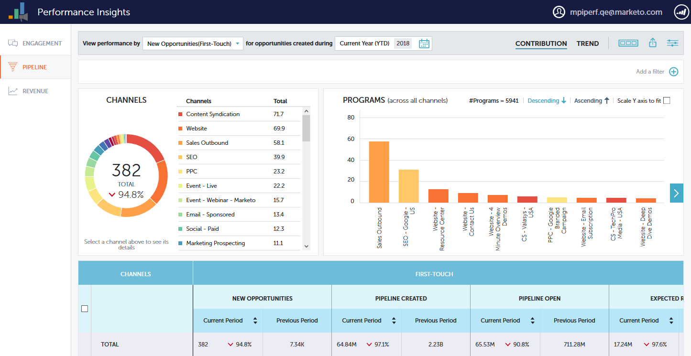

# Dashboards met prestatie-inzichten {#performance-insights-dashboards}

Meer informatie over de beschikbare dashboards in MPI.

## Betrokkenheid {#engagement}

Met het dashboard Betrokkenheid kunt u de effectiviteit van uw programma&#39;s voor het opvoeden en aanschaffen van nieuwe namen meten.

Maatschappelijke betrokkenheid

Kies de optie **Successen** metrisch om de betrokkenheid van het publiek in uw programma&#39;s van de Zorg te meten. Succes is een maatstaf voor betekenisvolle interactie in Marketo.

Het doel van een programma is een zinvolle interactie met de persoon of het vooruitzicht tot stand te brengen. Het succes wordt duidelijk wanneer een persoon de status bereikt die dat doel bereikt. Het kan een webinar bijwonen, op een koppeling in een e-mail klikken of een webformulier invullen. Het succes hangt af van het programmakanaal.

>[!NOTE]
>
>In een webinar programma, kunnen er veelvoudige statussen zijn, zoals: Uitgenodigd, geregistreerd en bijgewoond. Uitgenodigde of Geregistreerd zijn geen zinvolle interacties omdat mensen niet echt naar het webinar kijken. Bijgewoond wordt beschouwd als succes in dit geval.

Nieuwe naamverwerving meten

Kies de optie **Nieuwe namen** metrisch om de doeltreffendheid van uw nieuwe programma&#39;s van de naamverwerving te meten.

>[!NOTE]
>
>Al uw programma&#39;s moeten worden opgezet om het verwervingsprogramma en de verwervingsdatum van lood te bepalen opdat dit dashboard u de beste resultaten geeft.

## Pijpleiding {#pipeline}

Het Pipeline dashboard toont kanaalprestaties door eerste-aanraak en multi-aanrakingsmetriek.

<table> 
 <tbody> 
  <tr> 
   <td>
<strong>Nieuwe mogelijkheden</strong>
</td> 
   <td>
Het deel van de kredieten dat het programma heeft ontvangen om de schepping van nieuwe kansen te beïnvloeden. Het kan een fractie zijn als er meerdere leads bij betrokken waren.
</td> 
  </tr> 
  <tr> 
   <td>
<strong>Pipet gemaakt</strong>
</td> 
   <td>
Het deel van de kredieten (in monetaire waarde) dat het programma ontving om de schepping van kansen te beïnvloeden. Het kan een fractie van het totaal zijn als er meerdere leads bij betrokken waren.
</td> 
  </tr> 
  <tr> 
   <td>
<strong>Pipet open</strong>
</td> 
   <td>
Het deel van de kredieten (in monetaire waarde) dat het programma ontving om de schepping van nog openstaande kansen te beïnvloeden. Het kan een fractie van het totaal zijn als er meerdere leads bij betrokken waren.
</td> 
  </tr> 
  <tr> 
   <td>
<strong>Verwachte inkomsten</strong>
</td> 
   <td>
Het deel van de kredieten (in monetaire waarde) dat het programma ontving om de schepping van kansen te beïnvloeden. Verwachte opbrengsten zijn de opportuniteitswaarschijnlijkheid vermenigvuldigd met de opportuniteitswaarde. Het kan een fractie zijn als er meerdere leads bij betrokken waren.
</td> 
  </tr> 
  <tr> 
   <td>
<strong>Kosten per gemaakte opportuniteit</strong>
</td> 
   <td>
Het deel van de kosten van het programma dat de nieuwe kansen beïnvloedde gedeeld door het totale aantal nieuwe kansen die werden gecreëerd.
</td> 
  </tr> 
  <tr> 
   <td>
<strong>Pijpleiding gemaakt naar kostenverhouding</strong>
</td> 
   <td>
Het deel van de kredieten dat een programma heeft ontvangen om de schepping van nieuwe kansen te beïnvloeden, gedeeld door het deel van de kosten van het programma dat de schepping van kansen beïnvloedde.
</td> 
  </tr> 
 </tbody> 
</table>

## Ontvangsten {#revenue}

Het belastingdashboard laat kanaalprestaties zien door middel van &#39;first-touch&#39; en multi-touch metriek.

<table> 
 <tbody> 
  <tr> 
   <td>
<strong>Opportunity Won</strong>
</td> 
   <td>
Het deel van de kredieten dat een programma ontving om een eigen kans te beïnvloeden.
</td> 
  </tr> 
  <tr> 
   <td>
<strong>Won-inkomsten</strong>
</td> 
   <td>
Het deel van het krediet (in monetaire waarde) dat is ontvangen om een eigen kans te beïnvloeden.
</td> 
  </tr> 
  <tr> 
   <td>
<strong>Kosten per verkoopkans</strong>
</td> 
   <td>
Het deel van de kosten van het programma dat de nieuwe kansen beïnvloedde gedeeld door het totale aantal nieuwe kansen die werden gecreëerd.
</td> 
  </tr> 
  <tr> 
   <td>
<strong>Wonkosten-batenverhouding</strong>
</td> 
   <td>
Het deel van de kredieten (in monetaire waarde) dat werd ontvangen om een eigen kans te beïnvloeden, gedeeld door het deel van de kosten van het programma dat nieuwe kansen beïnvloedde.
</td> 
  </tr> 
 </tbody> 
</table>
