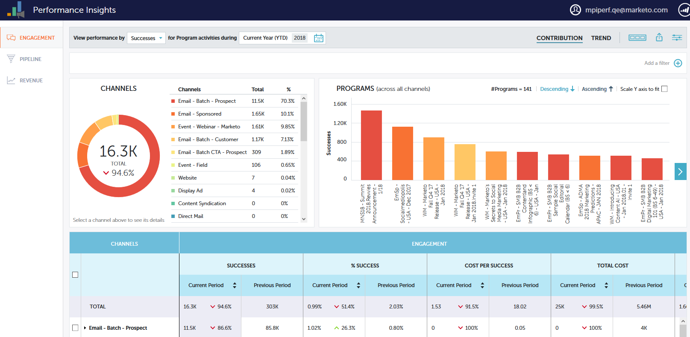

# [!UICONTROL Performance Insights] Overzicht {#performance-insights-overview}

Met Marketo [!UICONTROL Performance Insights] kunt u uw kanaalmix optimaliseren voor maximale effectiviteit en langetermijntrends detecteren om consistente, winnende strategieën te detecteren.

>[!AVAILABILITY]
>
>Niet iedereen heeft deze functie aangeschaft. Neem contact op met het Adobe-accountteam (uw accountmanager) voor meer informatie.

[!UICONTROL Performance Insights] laadt gegevens van (tot) de voorafgaande 24 maanden. Dit omvat actuele gegevens over het lopende jaar en de gegevens over het voorgaande jaar. Op 31 januari 2019 zal MPI bijvoorbeeld gegevens laden van die maand, en elke maand vanaf 2018. Op 31 december 2019 zal MPI gegevens laden van elke maand van 2019 en 2018.

Als u [!UICONTROL Performance Insights] wilt openen, klikt u op het bijbehorende pictogram op het beginscherm van Analytics.

## Bijdrage {#contribution}

Evalueer de 0&rbrace; bijdrage van de Marketing aan opbrengst [ als functie van klantenverwerving, invloed, omzetting, zelfs geïnstalleerde basisgroei.](/help/marketo/product-docs/reporting/performance-insights/performance-insights-contribution-overview.md)

Standaard weerspiegelen de weergegeven gegevens de prestaties van [!UICONTROL Engagement] . U kunt op prestaties overschakelen door **[!UICONTROL Pipeline]** of **[!UICONTROL Revenue]** eenvoudig op een van de twee te klikken.

## Trend {#trend}

Ontdek [ langetermijntendensen ](/help/marketo/product-docs/reporting/performance-insights/performance-insights-trend-overview.md) aan vlek verenigbare het winnen strategieën.

## Instellingen {#settings}

Klik in de [!UICONTROL Revenue] - en [!UICONTROL Pipeline] -dashboards op het pictogram [[!UICONTROL Settings]](/help/marketo/product-docs/reporting/performance-insights/performance-insights-settings.md) om extra parameters in te stellen.

## Gegevens exporteren {#export-data}

U kunt de gegevens en grafieken in [!DNL PowerPoint] of [!DNL Excel] exporteren. U kunt hen ook opslaan als a [ Snelle Grafiek ](/help/marketo/product-docs/reporting/performance-insights/performance-insights-quick-charts.md).

>[!NOTE]
>
>Exporteer gegevens naar [!DNL Excel] om de gegevens weer te geven die beschikbaar zijn voor alle kanalen (niet alleen de bovenste tien kanalen). De PPT-export is WYSIWYG (de uitvoer zal simuleren wat u op het scherm ziet).
