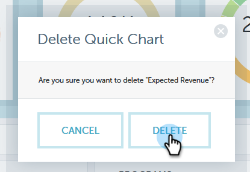

# [!UICONTROL Performance Insights] [!UICONTROL Quick Charts] {#performance-insights-quick-charts}

[!UICONTROL Quick Charts] zijn miniaturen die u aanpast en opslaat, zodat u snel grafieken kunt bekijken die u het meest gebruikt.

## Een nieuwe snelle grafiek maken {#create-a-new-quick-chart}

[!UICONTROL Quick Charts] is afgeleid van gegevens die u opgeeft. In dit voorbeeld, zullen wij kiezen: **nieuwe kansen (eerste aanraking), opportuniteitstype = nieuwe zaken, huidig jaar-aan-datum**.

1. Klik op het datumfilter en kies **[!UICONTROL Current Year (YTD)]** .

   

1. Klik **+** en selecteer uw criteria.

   

1. Het diagram wordt bijgewerkt met de filters die u hebt gekozen.

   

1. Klik op het pictogram Exporteren en selecteer **[!UICONTROL Save as Quick Chart]** .

   

1. Geef een naam op voor het Snelle diagram en klik op **[!UICONTROL Save]** .

   

Uw Snelle Grafiek is nu met anderen.

>[!NOTE]
>
>U kunt maximaal 20 snelle grafieken gebruiken. Ze kunnen worden verwijderd en vervangen.

## Bestaande snelle diagrammen weergeven {#view-existing-quick-charts}

1. Als u uw bestaande snelle grafieken wilt weergeven, klikt u gewoon op het pictogram **[!UICONTROL Quick Charts]** .

   

## Een snelle grafiek verwijderen {#delete-a-quick-chart}

Als u een Snelle Grafiek moet schrappen, volg deze eenvoudige stappen.

1. Klik op het pictogram **[!UICONTROL Quick Charts]** .

   

1. Houd de cursor boven het gewenste diagram, maar klik er niet op. Bij het aanwijzen wordt een X weergegeven. Klik **X**.

   

1. Klik op **[!UICONTROL Delete]**.

   
