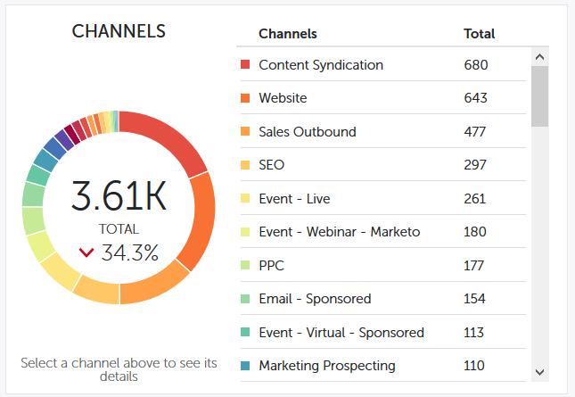

# Overzicht van trends voor prestaties {#performance-insights-trend-overview}

De trend toont kanaalprestaties van over een periode.

Klik op het tabblad **Trend** om deze weergave te openen.

## Trend {#trend}

Selecteer metrisch u de prestaties door wilt bekijken. In dit voorbeeld bekijken we de mogelijkheden die via [First Touch](/help/marketo/product-docs/reporting/revenue-cycle-analytics/revenue-tools/attribution/understanding-attribution.md) zijn verkregen.

Metrische gegevens worden via twee grafieken weergegeven: donut en lijn.

In het donutdiagram worden de tien bovenste kanalen weergegeven voor de metrische waarde die u hebt geselecteerd.

De lijngrafiek toont de trend van kanaalprestaties voor metrisch u in de afgelopen 12 maanden selecteerde.

Selecteer één of meerdere kanalen en de lijngrafiek toont de kanaaltrend. Klik nogmaals op het kanaal of de kanalen om de selectie op te heffen.

Het gegevensnet hieronder functioneert als een spreadsheet, die alle beschikbare trendgegevens voor metrisch toont u voor de laatste 12 maanden selecteerde.

Breid een kanaal uit om zijn hoogste tien programma&#39;s te zien, met de resterende programma&#39;s gecombineerd.

>[!NOTE]
>
>Als u op het selectievakje naast een kanaal klikt, wordt het kanaal in het donutdiagram geactiveerd of gedeactiveerd.
